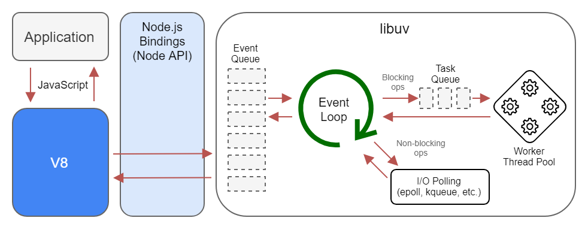

## JavaScript 병렬 처리

- JavaScript는 Single Thread 언어이다.
- 하지만 Event Loop를 이용하여 Multi-Thread 인 것처럼 동작할 수 있다.
- 만약 setTimeout이 들어있는 함수가 여러 개가 나열되어 실행된다면, 각각의 delay를 모두 기다렸다가 promise 객체가 반환되기 때문에 모든 delay를 합한 시간만큼 대기하게 된다.
- 하지만 이 함수들이 연관되어 있지 않아 서로를 기다릴 필요가 없다면 병렬 처리를 통해 시간을 단축할 수 있다.
  - Promsie.all 과 같은 method로 병렬 처리를 할 수 있다.

### Javascript Engine

- 자바스크립트 코드를 해석하고 실행하는 인터프리터
- webkit, v8 등등이 존재
- Heap + Call Stack
- Heap
  - 메모리 할당이 일어나는 부분
  - 변수, 객체 등이 저장되는 창고

### Call Stack

- 함수가 호출되는 순서대로 쌓이는 스택
- 함수 실행시 push, 종료시 pop

### Event Loop

- Callback Event Queue에서 하나씩 꺼내서 동작시키는 Loop
- call stack과 callback queue를 모니터링
- Event Loop에서는 이벤트 발생 시 호출되는 callback들을 task queue에 전달하고, task queue에 담겨 있는 callback들을 call stack에 넘긴다.
  - call stack이 **비어있을 때**, event loop는 task queue의 callback들을 call stack으로 넘긴다.
  - task queue (callback queue)
    - FIFO. 비동기 작업들이 실행된 후, 호출되는 callback들이 기다리는 공간

## libuv

- NodeJS의 event loop에 존재
- 비동기 입출력, 이벤트 기반에 초점을 맞춘 라이브러리
- 전통적으로 IO 처리는 요청마다 새로운 thread를 사용하지만, libuv는 비동기, non-blocking으로 처리한다.
- 이벤트를 모니터링한다.
- node.js가 libuv 위에서 동작한다.
  - node.js의 core는 v8 api, libuv api로 구현되어 있다.

### 동작

- node instance가 생성될 때, libuv에는 worker thread pool이 생성된다.
  - worker thread는 default로 4개
  - worker thread는 kernel에서 지원하지 않는 작업들을 수행한다.
    - file system 관련 작업 등
- application 단에서 코드가 실행되면 libuv가 호출된다.
- libuv가 비동기 처리를 할지, 동기 처리를 할지 검사
- 비동기 작업이 들어오면, libuv는 kernel 단에서 비동기 함수들을 호출하거나 worker thread에게 작업을 넘겨준다.
- 작업이 완료되면 system call을 libuv 내의 event loop에 callback으로 등록된다.

