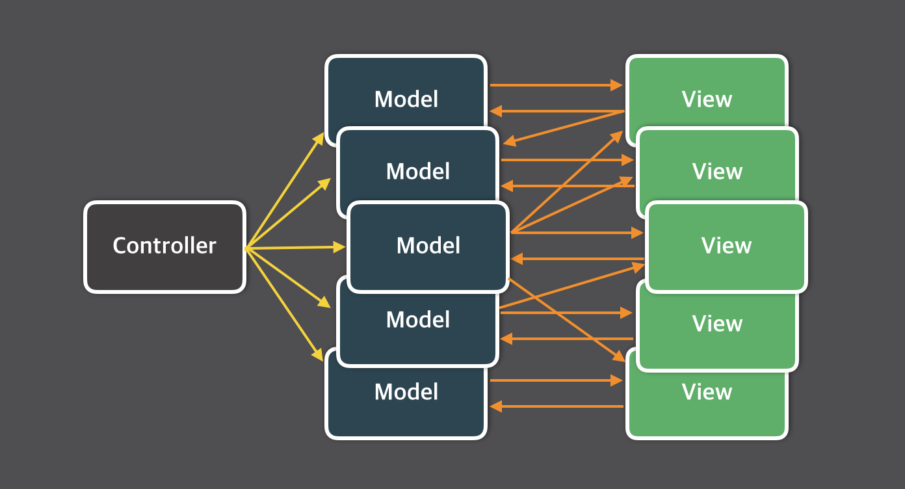
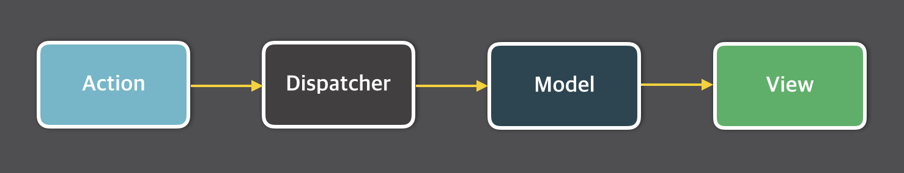
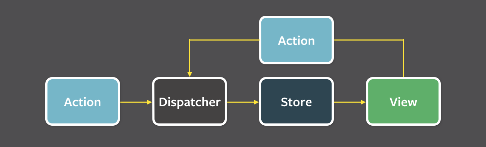
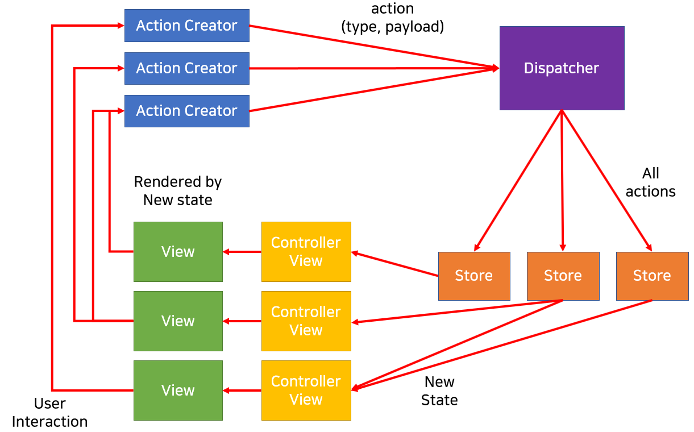
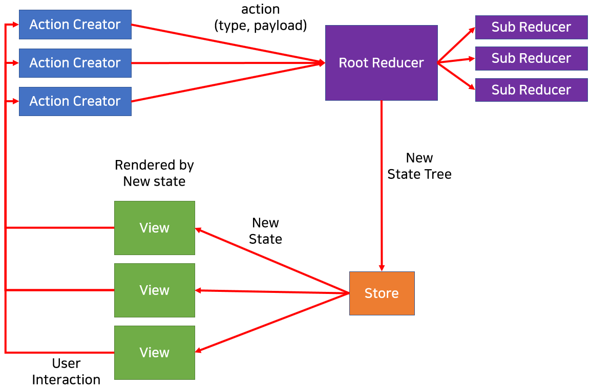

## Flux 패턴의 등장 배경

> 이전에 Front-End에서 주로 사용되는 패턴은 MVC 패턴이였다고 한다.

- 하지만 프로젝트가 무거워지면서 점점 수많은 View와 Model들이 생겨나게 되었고, 이를 파악하기가 어려워졌다.
- 따라서 이를 효율적으로 **“데이터 흐름을 일관성 있게 관리”**하여 예측 가능성(predictability)을 높이기 위해 Flux 패턴이 등장했다고 한다.

### MVC란?

> Model, View, Controller의 약자

- Model : 데이터를 저장
- Controller : Model에 저장된 데이터를 관리 (CRUD)
- View : Model의 데이터가 변경되면 View가 이를 전달 받아 사용자에게 보여줌

만약 View를 통해 사용자에게 입력을 받게 된다면, 데이터를 보여주는 역할을 가진 **View 또한 데이터를 업데이트할 수 있게 되어 데이터가 “양방향”으로 흐를 수 있다**.

→ 프로젝트가 커지면서 위 같은 구조가 많아진다면?

- View가 상호작용하며 여러 Model을 동시에 업데이트하고, 이에 따라 연관된 모든 View에 데이터를 전달
  - 굉장히 복잡한 데이터 흐름을 갖게 된다.
  - 따라서, 디버깅과 데이터 흐름을 추적하기 어려워진다.

## Flux 패턴

> 사용자 입력을 기반으로 Action을 만들고, Action을 Dispatcher에 전달하여 Store(Model)의 데이터를 변경한 뒤 View에 반영하는 단방향의 흐름으로 어플리케이션을 만드는 구조

### Action

> 데이터를 변경하는 행위

- Dispatcher에게 전달되는 객체이다.
- 유저로부터 발생하는 이벤트
- Action creator 메서드는 새로 발생한 Action의 **type**과 **payload** (새로운 데이터)를 묶어 dispatcher에게 전달한다.

### Dispatcher

> 모든 데이터의 흐름을 관리하는 역할

- Dispatcher에는 store들이 등록해놓은 Action 타입들의 callback들이 존재
- Action을 감지하면 type에 맞는 store의 callback을 실행
- Dispatcher를 통해서만 store의 데이터를 업데이트할 수 있다.
- Store들 사이에 dependency가 존재한다면, 순서에 맞게 callback을 처리할 수 있도록 관리
- Flux 패턴 내에서 Dispatcher는 오직 하나만 존재

### Store (Model)

> 상태 (데이터) 저장소

- 상태와 상태를 변경할 수 있는 메서드를 가지고 있다.
- Dispatcher에 Action의 type에 따른 callback 함수를 등록한다.
- Callback이 실행되어 상태가 변경되면 View에게 상태가 변경되었음을 알린다.

### View

> Store의 데이터를 이용하여 사용자에게 보여주는 역할

- React의 Component와 같은 역할
- Store에서 View에게 상태가 업데이트됨을 알려주면 최상위 View (Controller View)는 Store에서 데이터를 가져와 자식 View들에게 내려준다.
- 새로운 데이터를 받은 View는 화면을 리렌더링한다.
- 사용자가 만약 View에 어떠한 조작을 하면 그에 맞는 Action을 생성한다.

## Flux 패턴의 데이터 흐름

1. 유저가 **View**를 조작함으로써 **Action**이 발생
2. **state** 갱신 내용을 **Action**이 **Dispatcher**에 전달
3. **Dispatcher**가 Store에 **Action**을 전달하면서, Store에게 state 갱신을 명령
4. **Store**가 **state**를 갱신
5. 갱신된 **state**를 **View**에게 전달
6. 새로운 state가 브라우저(View)에 렌더링(표시)

→ 모든 Action이 Dispatcher를 거쳐가면서 단방향 데이터 흐름을 만들어낸 것이 가장 큰 특징!

# Redux

- JavaScript 라이브러리 중 하나로, JavaScript로 만들어진 어플리케이션들의 상태를 관리하기 위한 라이브러리
- Flux 패턴 + Reducer

### Redux의 특징

- Store는 오직 상태를 저장하는 역할만 수행
  - Flux에서는 store에서 상태를 갱신하기 위한 callback을 등록하고 저장하는 역할을 맡았지만, Redux에서는 **오로지 상태 보관의 역할만**을 수행한다.
- Reducer의 존재
  - store의 상태를 갱신하는 역할을 Reducer가 수행한다.
  - 현재 state와 주어진 action을 인자로 받아, state의 복사본을 생성하고 이를 수정하여 반환하는 순수 함수
    - 즉, 직접적으로 store의 값을 업데이트하지 않는다. (**immutable** state)
- Dispatcher가 존재하지 않는다.
  - Redux에서는 하나의 state만 존재하여 굳이 action을 모두 Dispatcher에서 받을 필요가 없다.
  - Reducer에서 action을 분류하여 store로 상태를 보낸다.
  - Dispatcher라는 개념이 없을뿐, 발생한 action을 reducer로 전달하여 실행시키는 과정을 Dispatch라고 한다.
    - 즉, action에 대한 이벤트 트리거

### Flux와 Redux의 구조 비교

https://basemenks.tistory.com/284

### [Redux를 언제 사용할까?](https://redux.js.org/faq/general#when-should-i-use-redux)

- 앱의 여러 위치에서 필요한 많은 양의 상태들이 존재할 때 (전역 상태가 필요하다고 느껴질 때)
- 상태들이 자주 업데이트 될 때
- 상태를 업데이트 하는 로직이 복잡할 때
- 앱이 중간 또는 큰 사이즈의 코드를 갖고 있고 많은 사람들에 의해 코드가 관리될 때
- 상태가 업데이트되는 시점을 관찰할 필요가 있을 때
