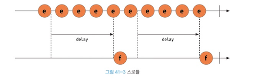
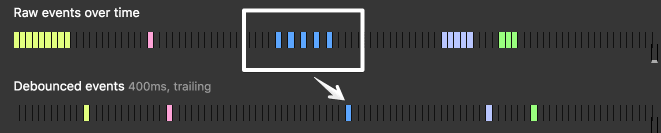

### [example] 자동 완성

- 자동 완성 기능을 구현할 때, input 창에 사용자가 입력을 할 때마다 API 요청을 보내게 된다면 어떻게 될까?
  - 사용자 수가 많아지면 그만큼 엄청난 API 요청이 발생하게 될 것이다.
  - 또한 사용자의 의도와는 무관하게 요청이 자주 발생하게 된다.
- 이를 줄이기 위해 `입력이 끝난 후`나 `입력되는 중간 중간 interval을 두어` API 요청을 하게 된다면 성능 최적화가 가능해진다.

## Throttle

자바스크립트 딥다이브

> 입력 주기를 방해하지 않고, 일정 시간 동안의 입력을 모아 요청

- 여러번 발생하는 이벤트를 일정 시간인 interval을 두고, interval 동안의 입력을 한번에 모아 요청을 한다.
- 즉, 마지막 함수가 호출된 후 일정 시간이 지나기 전에 다시 호출되지 않도록 하는 것
- 스크롤 이벤트에 자주 사용된다고 한다.

## Debounce

https://webclub.tistory.com/607

> 입력 주기가 끝나면 요청

- 사용자 입력이 끝난 후에 마지막 이벤트에 대해 요청
- 즉, 연이어 호출되는 함수들 중 마지막 함수(또는 제일 처음)만 호출하도록 하는 것
- 검색 기능의 키 이벤트에 자주 사용된다고 한다.

### Throttle과 Debounce의 공통점

- 두 기법 모두 자주 사용되는 이벤트나 함수들의 실행되는 빈도를 줄여 성능 상의 유리함을 가져오기 위한 개념

### Throttle과 Debounce의 차이점

> 이벤트를 발생 시킬 **시점의 차이**

- Debounce는 입력이 끝날 때까지 무한적으로 기다린다.
- 하지만 Throttle은 입력이 시작되면 일정 주기로 계속 실행한다.
