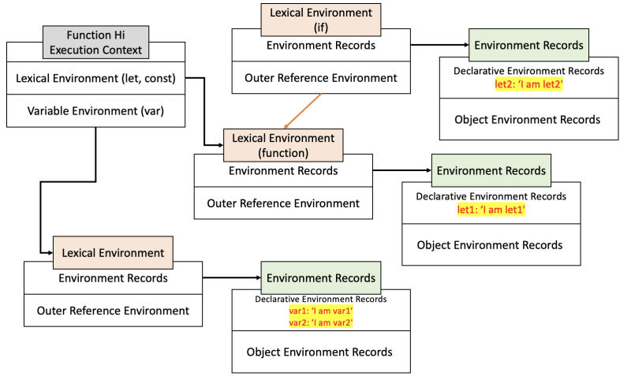

# 실행 컨텍스트 (Execution Context)

자바스크립트를 처음 공부할 때, `Hoisting`, `Closure`와 함께 실행 컨텍스트도 중요한 개념중 하나라고 알고 있었다.

하지만 당시에는 얕게 자바스크립트 코드가 실행되면서 Call Stack에 들어가 실행되는 함수 정도로만 생각하고 넘어갔었다.

하지만, 처음에 정말 이해를 잘 못했던 `Closure`와 연관이 깊기도 하고, 면접에서도 자주 물어본다고 들어 주제로 선정하게 되었다.

## 실행 컨텍스트란?

> 실행할 코드에 제공할 환경 정보들을 모아놓은 객체

그럼 이 실행 컨텍스트는 언제 만들어질까?

1. 자바스크립트 코드가 맨 처음 실행되었을 때
2. 함수가 호출되었을 때
3. `eval()`이 호출되었을 때 ([MDN](https://developer.mozilla.org/ko/docs/Web/JavaScript/Reference/Global_Objects/eval)에서는 `XSS` 공격이 문제가 될 수 있어 절대 사용하지 말라고 함!)

가장 처음 코드가 실행되면서 `전역 실행 컨텍스트(Global Execution Context)`가 Call Stack에 쌓인다.
그리고 함수 호출이 발생하면 `실행 컨텍스트`가 차례대로 Call Stack에 쌓이게 되고, 코드의 환경과 순서를 보장하게 된다.

예를 들면, 다음과 같다.

```javascript
const c = "c";

function b() {
  // ...
}

function a() {
  // ...
  b();
}

a();
```


위와 같은 코드가 있을 때, 실행 결과는 그림과 같다. <br/>

1. 코드가 처음 실행되면서 전역 실행 컨텍스트가 가장 먼저 Call Stack에 쌓인다.
2. 변수와 함수가 정의된 후, 함수 `a`가 실행되며 이에 대한 실행 컨텍스트가 쌓인다.
3. 함수 `a` 내부에서 함수 `b`가 실행되어 또 이에 대한 실행 컨텍스트가 쌓인다.
4. 이후 함수가 종료되었을 때, 차례대로 Call Stack을 빠져나간다.

## 실행 컨텍스트의 구조

그렇다면 실행 컨텍스트가 가지고 있는 정보에는 어떤 것들이 있을까?

우선, 실행 컨텍스트는 2개의 환경으로 나뉜다.

1. Function Scope 변수인 `var`로 선언된 변수를 저장하는 `Variable Environment`
2. Block Scope 변수인 `let, const`로 선언된 변수를 저장하는 `Lexical Environment`

위의 두 환경은 공통적으로 또다시 2개의 영역으로 나뉜다.

1. 변수, 함수 이름과 관련된 **값**을 저장하는 `Environment Record`
2. 상위 scope의 **Lexical Environment**를 가리키는 `Outer Environment Reference`

구조는 같지만 두 환경에는 차이가 존재한다. <br/>
`Variable Environment`은 스냅샷을 저장하여 변경 사항이 반영되지 않지만, `Lexical Environment`는 변경 사항이 반영된다는 것이다.

글로만 보면 뭔소린지 모르겠으니 그림으로 봐보자. <br/>
아래와 같은 코드에 대한 실행 컨텍스트이다.

```javascript
function Hi() {
  let let1 = "I am let1";
  var var1 = "I am var1";
  if (true) {
    let let2 = "I am let2";
    var var2 = "I am var2";
  }
}

Hi();
```



## Hoisting이 일어나는 이유

## Closure가 가능한 이유
