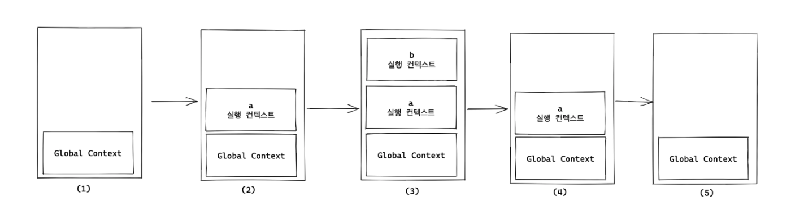

# 실행 컨텍스트 (Execution Context)

자바스크립트를 처음 공부할 때, `Hoisting`, `Closure`와 함께 실행 컨텍스트도 중요한 개념중 하나라고 알고 있었다.

하지만 당시에는 얕게 자바스크립트 코드가 실행되면서 Call Stack에 들어가 실행되는 함수 정도로만 생각하고 넘어갔었다.

하지만, 처음에 정말 이해를 잘 못했던 `Closure`와 연관이 깊기도 하고, 면접에서도 자주 물어본다고 들어 주제로 선정하게 되었다.

## 스코프 (Scope)

실행 컨텍스트에 대해 알아보기 전에, **스코프**라는 개념에 대해 알아보자. <br/>
얼핏 들었을 때에는 "스코프?"라고 생각하기 쉽지만 생각보다 친숙하고 간단한 개념이다.

> 현재 실행되는 컨텍스트 - MDN

MDN에서는 "이 컨텍스트가 값과 표현식이 표현되거나 참조될 수 있음을 의미한다."라고 말하고 있다. <br/>
즉, 간단히 말하자면 **변수나 함수가 유효한 범위**를 의미한다. <br/>
일반적으로 우리는 함수 내부에 정의된 변수를 함수 외부에서는 접근할 수 없다는 것을 알고 있다. <br/>
스코프가 계층적인 구조를 가지기 때문에 상위 스코프에서 하위 스코프에 접근할 수 없다는 사실을 이미 알고 있는 것이다.

아래 코드를 예시로 들어보자.

```javascript
function sayMyName() {
  var name = "Heo";
  console.log("My name is ", name);
}

sayMyName(); // Output: "My name is Heo"
console.log(name); // Error
```

`sayMyName`이라는 함수는 전역으로 선언된 함수이기 때문에 스코프가 전역이다. <br/>
하지만 `name`이라는 변수는 함수 내에서 선언된 변수이기 때문에 접근시 에러가 발생한다.

스코프에는 전역 스코프와 같은 몇가지의 종류가 있지만, 일반적으로 JavaScript에서는 주로 다루는 스코프는 3가지이다.

### 함수 스코프 (Function Scope)

함수 내에서 `var`로 선언되거나 정의된 변수는 **함수 내에서만** 사용이 가능하다.<br/>
위의 예시와 동일한 내용이므로 예시는 생략한다.<br/>
스코프가 함수로 한정되므로, `if` 혹은 `loop`로 생성된 스코프 내의 변수들은 외부에서 접근이 가능하다.

```javascript
var nationality = "korean";
if (true) {
  var isKorean = nationality === "korean";
  // ...
}

console.log(isKorean); // Output: true
```

### 블록 스코프 (Block Scope)

ES6에서 `let`과 `const`가 등장하며 생겨난 스코프이다. <br/>
위 두 키워드로 선언된 변수는 블록 스코프를 갖는다. <br/>
블록 스코프라 말하여 무엇인가 싶지만, 중괄호(`{`,`}`)를 의미한다.<br/>
따라서, 위의 예시에 if문 내의 `var`를 `let`으로 변경하면 결과가 달라진다.

```javascript
var nationality = "korean";
if (true) {
  let isKorean = nationality === "korean";
  // ...
}

console.log(isKorean); // Uncaught ReferenceError: isKorean is not defined
```

### 렉시컬 스코프 (Lexical Scope)

아마 렉시컬이라는 말이 굉장히 생소할 수 있지만, 가장 단순하면서도 중요한 개념이다.

예를 들어보자. <br/>
만약 내가 사는 동탄이 특정 `스코프`, 사진이 `함수`라면, 사진을 찍는 행위가 `함수 선언`이고, 사진을 보는 것은 `함수 호출`에 빗댈 수 있다. <br/>
그리고 우리가 카메라로 날씨가 화창한 날 동탄의 풍경 사진을 찍는다고 생각해보자. <br/>
언제봐도 그 사진은 동탄의 어느 화창한 풍경의 사진일 것이다. <br/>
비가 오는 날, 부산에 가서 그 사진을 다시 본다고 해서 갑자기 부산에 비가 오는 사진이 찍혀있지는 않을테니까 말이다. <br/>
<strike>(나름 열심히 설명해본다고 써본 예시인데, 더 어려운가 싶기도 하고 ㅎ)</strike>

따라서, `렉시컬 스코프`란, 함수를 어디서 호출하는지가 아닌, 어디서 **선언**했는지에 따라 결정되는 스코프이다. <br/>
특정 스코프에 F라는 함수를 선언하고 정의했다면, 해당 스코프가 F 함수의 하위 스코프가 될 것이다.

```javascript
var location = "DongTan";

function F2() {
  var location = "Busan";
  F1();
}

function F1() {
  console.log("I live in ", location);
}

F2(); // Output: I live in DongTan
F1(); // Output: I live in DongTan
```

F2 함수에서 location이라는 변수를 또다시 선언했지만, F1 함수가 선언되는 시점에 저장된 값이 출력되는 것을 확인할 수 있다.

## 실행 컨텍스트란?

그럼 이제 정말 실행 컨텍스트에 대해 알아보자.

> 실행할 코드에 제공할 환경 정보들을 모아놓은 객체

이 실행 컨텍스트는 언제 만들어질까?

1. 자바스크립트 코드가 맨 처음 실행되었을 때
2. 함수가 호출되었을 때
3. `eval()`이 호출되었을 때 ([MDN](https://developer.mozilla.org/ko/docs/Web/JavaScript/Reference/Global_Objects/eval)에서는 `XSS` 공격이 문제가 될 수 있어 절대 사용하지 말라고 함!)

위의 내용을 상기시켜보자. <br/>
스코프는 실행되는 컨텍스트라 했으므로, 스코프가 발생하면 실행 컨텍스트가 생성되는 것이다.

가장 처음 코드가 실행되면서 **전역 스코프**에 대한 `전역 실행 컨텍스트(Global Execution Context)`가 Call Stack에 쌓인다.
그리고 함수 호출이 발생하면 이에 따라 생성되는 스코프의 `실행 컨텍스트`가 차례대로 Call Stack에 쌓이게 되고, 코드의 환경과 순서를 보장하게 된다.

예를 들면, 다음과 같다.

```javascript
const c = "c";

function b() {
  // ...
}

function a() {
  // ...
  b();
}

a();
```



위와 같은 코드가 있을 때, 실행 결과는 그림과 같다. <br/>

1. 코드가 처음 실행되면서 전역 실행 컨텍스트가 가장 먼저 Call Stack에 쌓인다.
2. 변수와 함수가 정의된 후, 함수 `a`가 실행되며 이에 대한 실행 컨텍스트가 쌓인다.
3. 함수 `a` 내부에서 함수 `b`가 실행되어 또 이에 대한 실행 컨텍스트가 쌓인다.
4. 이후 함수가 종료되었을 때, 차례대로 Call Stack을 빠져나간다.

## 실행 컨텍스트의 구조

그렇다면 실행 컨텍스트가 가지고 있는 정보에는 어떤 것들이 있을까?

우선, 실행 컨텍스트는 2개의 환경으로 나뉜다.

1. 함수 스코프 변수인 `var`로 선언된 변수를 저장하는 `Variable Environment`
2. 블록 스코프 변수인 `let, const`로 선언된 변수를 저장하는 `Lexical Environment`

위의 두 환경은 공통적으로 또다시 2개의 영역으로 나뉜다.

1. 변수, 함수 이름과 관련된 **값**을 저장하는 `Environment Record`
2. 하위 scope의 **Lexical Environment**를 가리키는 `Outer Environment Reference` <br/>
   (하위일수록 전역 컨텍스트에 가까움)

물론, 전역 실행 컨텍스트는 더이상 하위 컨텍스트가 존재하지 않기 때문에 `Outer Environment Reference`는 `null`이 된다.

구조는 같지만 두 환경에는 차이가 존재한다. <br/>
`Variable Environment`은 스냅샷을 저장하여 변경 사항이 반영되지 않지만, `Lexical Environment`는 변경 사항이 반영된다는 것이다.

따라서 구조는 다음 그림과 같다.


글로만 보면 뭔소린지 모르겠으니 그림으로 봐보자. <br/>
아래와 같은 코드에 대한 실행 컨텍스트이다.

```javascript
function Hi() {
  let let1 = "I am let1";
  var var1 = "I am var1";
  if (true) {
    let let2 = "I am let2";
    var var2 = "I am var2";
  }
}

Hi();
```


## Hoisting이 일어나는 이유

JavaScript를 접한 사람이라면 모두가 Hoisting에 대해 알고 있을 것이다.

> 인터프리터가 코드를 실행하기 전에 함수, 변수, 클래스 또는 임포트(import)의 선언문을 해당 범위의 맨 위로 끌어올리는 것처럼 보이는 현상 - MDN

즉, 변수나 함수의 선언이 마치 해당 스코프의 최상단으로 **끌어올려지는** 현상을 말한다. <br/>
실제로 인터프리터가 코드의 내용을 진짜 끌어올리는 것이 아니라, 실행 컨텍스트가 생성되는 과정상 이러한 현상이 일어나는 것이다.

그럼 실행 컨텍스트는 어떻게 만들어지길래 이런 현상이 일어날까?

실행 컨텍스트가 만들어지는 과정은 다음 2가지로 나누어진다.

1. Creation Phase
2. Exectuion Phase

먼저, `Creation Phase`는 **실행 컨텍스트에 대한 정의 과정**이다.

해당 페이즈에서는 실행 컨텍스트의 `Variable Environment`와 `Lexical Environment`에 대한 정의가 이루어진다.

즉, `var`, `let`, `const`로 선언된 명시적인 변수들에 대한 정의가 이루어지는 것이다. <br/>
먼저, `var`로 선언된 변수는 이때 변수 `선언 단계`와 `초기화 단계`가 진행되어 메모리 공간을 할당 받고, 값을 `undefined`로 초기화한다. <br/>
반면, `let`과 `const`로 선언된 변수의 경우, 변수 **`선언 단계`만** 진행되어 실행 컨텍스트에 **등록은 되었지만 값이 초기화되지 않는다.** <br/>
따라서 `var`로 선언된 변수와 달리 `TDZ`라는 사각지대에 빠져, 접근시 `ReferenceError: Cannot access 'a' before initialization` 에러가 발생한다.

이것이 바로 `Hoisting`이 발생하는 이유이다. <br/>
그리고 `let`과 `const`로 선언된 변수도 선언 단계를 거치고 **초기화되지 않았을뿐**, `Hoisting`이 일어나지 않은 것은 아니다. <br/>
만약, `Hoisting`이 일어나지 않았다면, 초기화가 아닌 정의가 되지않았다는 에러가 나타나기 떄문이다.

이후 `Execution Phase`에서는 `Creation Phase`에서 생성된 컨텍스트들을 바탕으로 코드를 실행하는 과정이다. <br/>
즉, 선언된 변수들에 대해 실제 명시된 값을 할당하거나 함수를 실행한 결과를 변수에 저장한다.

## Closure

`Hoisting`에 이어 `Closure` 또한 JavaScript에서 매우 중요한 개념이다.<br/>
그럼 `Closure`란 무엇일까?

```javascript
function outerFunction() {
  let outerVariable = "I am outer!";

  function innerFunction() {
    console.log(outerVariable);
  }

  return innerFunction;
}

let closure = outerFunction();
closure(); // 출력 결과: "I am outer!"
```

위 예시를 살펴보자.

1. `outerFunction`은 `innerFunction`을 선언하고, 이러한 `innerFunction`을 반환하는 함수이다.
2. `outerFunction`을 호출하여 `closure`라는 변수에 `innerFunction`를 참조시킨다.
3. `closure`을 호출하여 함수를 실행하면 innerFunction이 수행되며 `I am outer!`가 출력된다.

앞서 이야기한 실행 컨텍스트에 의하면 스코프가 생성되어 실행 컨텍스트가 생성되고 호출이 끝나고 나면 실행 컨텍스트와 관련된 메모리는 정리되어야 한다. <br/>
하지만, 위의 예시에서 `outerFunction`이 실행되고 종료된 후에도 `closure`에 참조된 `innerFunction`은 `outerFunction` 내부에 선언된 `outerVariable`을 기억하며 정상동작한다. <br/>
이것이 바로 `Closure`이다.

## Closure가 가능한 이유

앞에서 말한 스코프중, 렉시컬 스코프는 함수가 선언될 때 스코프가 결정된다고 하였다. <br/>
즉, 함수가 선언될 당시의 환경을 기억한다는 것이다. <br/>
따라서, `innerFunction`이 **선언될 당시의 환경을 기억**하기 때문에 이러한 `Closure`가 가능한 것이다.

그럼 `innerFunction`이 실행될 때는 `outerFunction`은 이미 종료된 상태인데, 어떻게 `innerFunction`이 어떻게 기억하고 `outerFunction`에 접근할 수 있을까? <br/>

정답은 `Garbage Collection (GC)`와 관련이 있다. <br/>
GC의 모토는 **참조되지 않는 메모리는 쓸모없다**는 것이다.
따라서 `outerFunction`의 `Lexical Environment`에 **참조가 남아있어** GC의 대상이 되지 않았기 때문이다. <br/>

`outerFunction`은 종료될 때, `innerFunction`을 반환한다. <br/>
즉, `closure`가 이 `innerFunction`의 참조 변수이고, `closure`를 통해 `innerFunction`의 실행 컨텍스트가 생성되면 `outer Environment Reference`(하위 스코프의 `Lexical Environment`를 참조하는 포인터)가 `outerFunction`의 `Lexical Environment`를 참조해야 하기 때문에 GC의 대상이 되지 않는다. <br/>
따라서 `innerFunction`은 이 Reference를 통해 `outerFunction`의 `Lexical Environment`에 접근하여 정상적으로 실행이 가능한 것이다.

## 느낀 점

처음 Hoisting과 Closure를 공부할 때에는 막상 외우기만 하려니 개념 자체가 이해도 안되고 어려웠다. <br/>
이후, JavaScript의 동작 방식을 공부하다 Garbage Collection에 대해 알게 되었다. <br/>
그리고 GC를 공부하며 Hoisting과 Closure의 원리에 대해 유추하는 과정을 거치고 학습을 하니 막상 외우는 것보다 이해가 훨씬 잘되었다. <br/>
공부는 이렇게 하는 것인가보다를 매번 깨닫지만 마음만큼 잘 안되는 것 같다. <br/>
이번 글을 계기로 계속 이렇게 원리를 파악하며 공부하는 습관을 들일 것이다. 꼭! <br/>

혹시나 이번 글에 부족한 점, 이건 꼭 더 알아야한다! 하는 것들이 있으면 무한 의견 부탁드립니다!!!!
