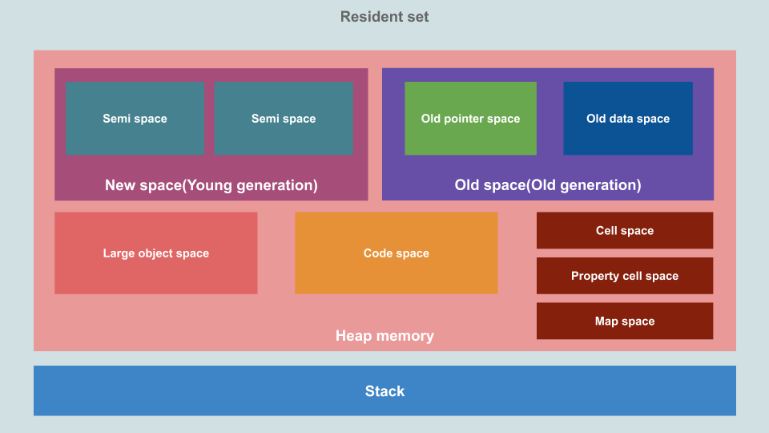
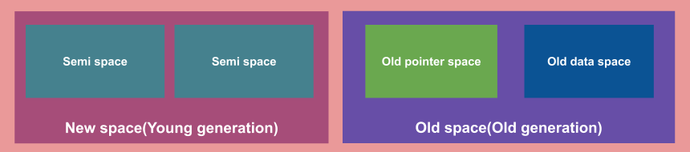
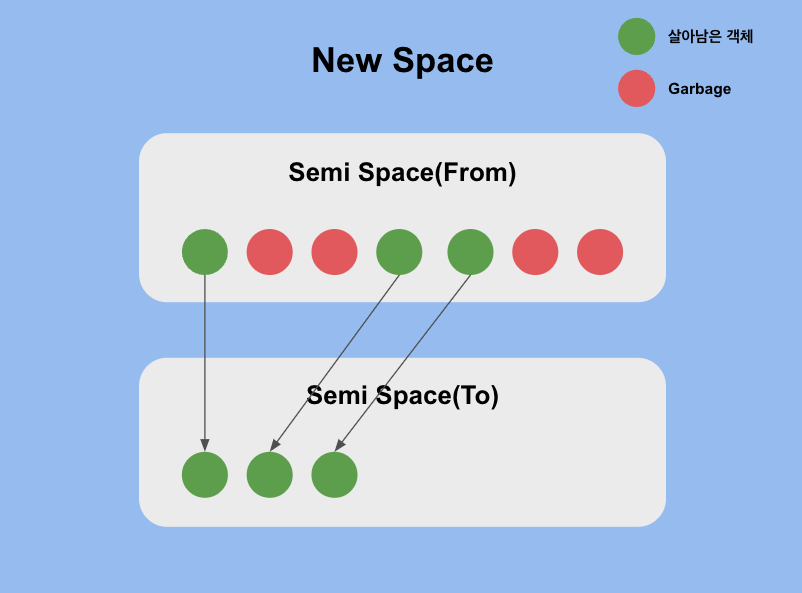
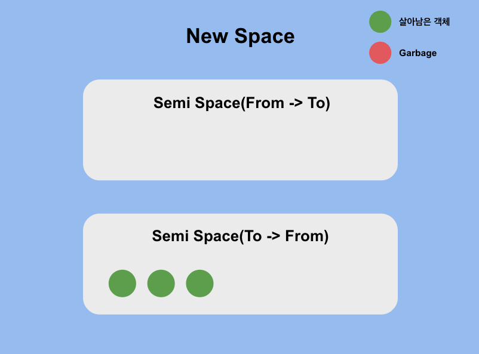
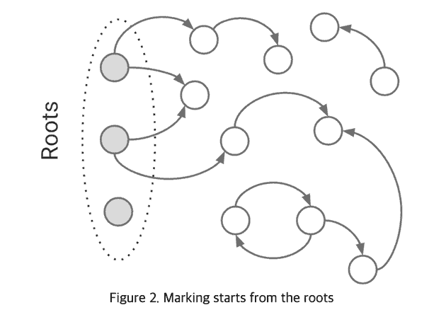
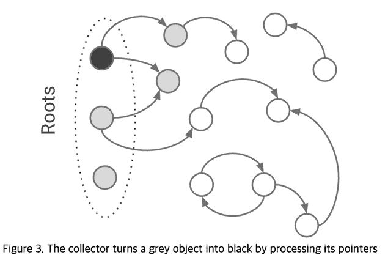

# Garbage Collection in JavaScript

이전 직장에서 사용하던 `C++`는 `malloc`, `kalloc`, `valloc` 등의 다양한 메모리 할당 함수를 통해 개발자가 직접 메모리를 할당하고, `free` 함수를 통해 직접 메모리를 해제한다.

따라서 작성하는 코드의 길이가 길어질수록 메모리를 할당한 변수를 깜빡하고 해제하지 않는 경우도 은근히 발생하여 `Memory Leak`이 발생하기도 하였다.

이러한 불편함을 해소하기 위해 **JVM**과 **JavaScript Engine**은 `Garbage Collection`을 통해 사용하지 않는 객체들을 수거하여 메모리 공간을 확보한다.

> 즉, 어질러져 있는 방 안(메모리 공간)을 청소 로봇(Garbage Collector)이 직접 방을 청소해주는 것이다.

## V8 Engine의 메모리 구조

그럼 **방**에 해당하는 메모리 구조를 살펴보자. <br/>
다음은 JavaScript가 실행되는 엔진중, NodeJS와 크롬에서 사용하는 `V8 Engine`의 메모리 구조이다.



우선, JavaScript는 Call Stack이 하나인 **Single-Thread** 언어이기 때문에 하나의 `Stack`이 보인다.

그 외에는 `Heap`으로 Stack에 비해 구조가 복잡해보인다. <br/>
오늘 눈여겨 볼 공간은 <U>Heap 영역과 그 안에 존재하는 New Space와 Old Space</U>이다.

## JavaScript의 메모리 관리

그럼 다음은 방을 어질러 놓을 **Garbage**들이 어떻게 생기는지 알아보자. <br/>
JavaScript에서는 <U>변수 선언시 자동으로 메모리를 할당</U>한다. <br/>

### Stack 영역

number, string 등과 같은 **Primitive Type**의 경우, `Stack` 영역에 저장하고, 함수 호출이 끝나면 콜스택을 빠져나가며 OS에 의해 메모리가 정리된다. <br/>

### Heap 영역

**반면**, 객체, 배열 등과 같은 **Reference Type**의 경우, 참조할 <U>주소값만 Stack 영역에 저장</U>하고, `Heap` 영역에 저장한다.
하지만 위에서 언급했듯이, Stack 영역에 저장된 값들은 함수 호출이 끝나면 메모리가 정리된다.

즉, 함수 호출이 끝나 Stack 영역의 메모리가 정리되면 객체나 배열 등의 **주소값의 정보** 또한 함께 정리되어 <U>더이상 참조되지 않는 메모리</U>가 발생하게 된다.

이것이 바로 `Garbage`이다.
만약 Garbage들이 무수히 쌓이게 된다면, 프로세스의 메모리가 점점 커져 속도가 느려지거나, 메모리 부족 등 다양한 문제를 일으키게 될 것이다.

이러한 문제를 방지하기 위한 청소 로봇이 바로 `Garbage Collector`이다.
더이상 사용하지 않는 메모리들은 `Garbage Collector`에 의해 수거되어 메모리가 해제된다.

> 이렇게 `Garbage Collector`가 사용하지 않는 메모리를 수거하고, 해제하는 것을 `Garbage Collection`이라고 한다.

(추가적으로 [V8 Engine에서 메모리를 사용하는 예시](https://speakerdeck.com/deepu105/v8-memory-usage-stack-and-heap)를 슬라이드로 만들어 둔 것이 있어서 올려둠!)

## Garbage Collection

서론이 길었는데, 이제 정말 대망의 메모리 영역을 청소하는 `Garbage Collection`에 대해 알아보자.

우선, Heap의 구조를 다시 가져와 보자.



우선, 이렇게 나뉘게 된 배경은 [The Generational Hypothesis](https://www.memorymanagement.org/glossary/g.html#term-generational-hypothesis)라는 가설이다. <br/>
(GPT피셜 **John McCarthy**라는 분이 주장했다고 함!) <br/>
해당 가설의 내용은 다음과 같다.

> 대부분의 경우, 새로운 객체가 오래된 객체보다 쓸모없어질 가능성이 높다.

가설에 따라보면, 모든 객체를 매번 검사하여 GC를 실행하기보다, 오래된 객체보다 새로운 객체들에 대해서 GC를 실행하는 것이 더 효율적일 것이다.

따라서 V8 Engine은 이러한 특성에 맞게 다음과 Heap 영역을 분리하였다.

- 새로운 객체들이 관리되는 `New Space`
- New Space에서 산전수전공중전 다 겪으며 살아남은 객체들이 관리되는 `Old Space`

따라서, `Garbage Collection`은 크게 2가지로 나누어 다르게 동작한다.

1. **New Space**에서 일어나는 `Minor GC`
2. **Old Space**에서 일어나는 `Major GC`

## Minor GC

> Scavenger란 까마귀, 독수리, 하이에나 등과 같이 자연에서 청소부 역할을 하는 동물을 뜻함 (나무위키)

**Scavenger**라 불리는 Minor GC는 New Space에서 청소를 담당한다. <br/>
Minor GC는 `Mark & Sweep` 알고리즘을 통해 살아남을 객체를 선별한다. <br/>
Minor GC는 매우 자주 발생하고, 병렬 헬퍼 스레드를 사용하기 때문에 굉장히 빠르다.

Minor GC에서 살아남은 객체들은 수거 대상들과 분류를 위해 항상 새로운 공간으로 대피를 해야한다. <br/>
따라서, 이것이 바로 위의 Heap 구조에서, New Space의 <U>Semi Space가 2개 존재하는 이유</U>이다.

2개의 Semi Space는 `From-Space`과 `To-Space`로 구분된다.

현재 New Space에 존재하는 객체들은 From-Space에 머무르고, To-Space는 비어있게 된다.
그리고 Minor GC를 실행하게 되면, 살아남은 객체들이 To-Space로 이동하게 된다.

이때, To-Space로 옮겨지는 객체들은 포인터가 바뀌며 **연속된 메모리로 이동**되며, 이를 통해 `메모리 단편화`를 방지할 수 있다.



이후, To-Space가 가득차게 되면 Semi Space는 아래 그림과 같이 다음 Minor GC를 실행할 때, 현재 <U>From-Space는 To-Space로, To-Space는 From-Space로 스위칭</U>된다.



만약 New Space에 존재하는 객체가 2번 생존할 경우, 해당 객체들은 Old Space로 옮겨져 `Major GC`의 대상이 된다.

([Minor GC를 설명한 자료](https://speakerdeck.com/deepu105/v8-minor-gc))

## Major GC

Major GC는 Old Space의 청소를 담당한다. <br/>
Major GC는 자주 일어나지 않으며 발생하는 시점은 V8 Engine이 Old Space의 메모리가 충분하지 않다고 판단될 때라고 한다.

Major GC는 `Mark-Sweep-Compact` 알고리즘과 `Tri-Color` 알고리즘을 사용한다.
기본적인 개념은 마찬가지로 더이상 참조되지 않는 개체를 쓸모없는 객체로 간주한다는 것이다.

### Mark-Sweep-Compact 알고리즘

**Marking**

- Garbage Collection의 대상이 되는 객체를 선별하기 위한 단계이다. <br/>
- GC Root로 부터 DFS를 통해 연결된 객체들을 모두 순회하며 `Tri-Color marking`을 실행한다.

**Sweeping**

- Marking 단계 이후에 `white`로 marking된 객체들을 `free-list`라 불리는 Linked List 자료구조에 추가하여 메모리를 해제한다.

**Compacting**

- 메모리 단편화가 심한 페이지들을 재배치하여 추가 메모리를 확보한다.

### Tri-Color 알고리즘

- GC 대상 객체를 선별하기 위한 알고리즘이다.
- GC Root라는 실행 스택과 전역 객체를 담고 있는 객체의 set부터 시작해서 객체들을 dfs로 순회하며 Tri-color(white, gray, black)로 마킹한다.
- 색의 의미는 다음과 같다.
  - white: GC가 아직 탐색하지 못한 상태
  - gray: 탐색은 했으나, 해당 객체가 참조하고 있는 객체가 있는지 확인을 안한 상태
  - black: 해당 객체가 참조하고 있는 객체까지 확인을 한 상태

1. 모든 객체를 `white`로 marking
2. GC Root 객체를 `gray`로 marking 후, deque에 push_front
3. pop_front로 deque에서 객체를 꺼내 `black`으로 marking
4. 꺼낸 객체가 참조하는 객체들을 `gray`로 marking 후, deque에 넣음
5. 여러 객체가 참조하는 객체인 경우 이미 `white`가 아닐 수 있기 때문에 `white` → `gray`인 경우에만 push_front
6. 위 과정을 deque이 빌 때까지 반복
7. `black`과 `white`로 marking된 객체들만 남게 됨




[📌 출처](https://v8.dev/blog/concurrent-marking)

✅ 최종적으로 `white`로 marking된 객체들이 GC 대상이 된다.

## 나의 생각 (온전히 내 생각이라 GC 얘기가 많이는 없음 ㅠ 패스해도 됨!)

다른 이야기긴 하지만, 이전 회사에서 나는 Linux 환경에서 모바일 기기의 Kernel Driver를 개발하는 업무를 진행했었다. <br/>
이때 코드 중간에 변수 선언하는 것을 컴파일러 자체가 막아놨었다. (C99부턴가 가능해졌다고 한다...)

```C
int getTotal(int arr[], int len) {
	int sum = 0; // ok

	for(int i = 0 ; i < len ; i++) {
    	sum += arr[i];
    }

    int ret = sum; // -> error

    // ...
}
```

즉, 함수 초반에 변수를 정의하는 것만이 허용되었다.
이때는 컴파일러가 정책으로 막아두었기 때문에 별다른 생각없이 그렇구나하고 넘어갔었다.

하지만, 퇴사를 하고 어느날 문득 든 생각이 있다.

> 지역성(Locality) 때문인가?

먼저, 캐시의 기본 개념이 되는 지역성을 소개하자면, 2가지가 존재한다.

### Spatial locality

> 어떤 메모리 공간을 참조했다면, 이후 해당 메모리의 주변 메모리를 참조할 확률이 높다.

### Temporal locality

> 어떤 메모리 공간을 참조했다면, 이후 다시 이 메모리를 참조할 확률이 높다.

대학교때 운영체제 강의를 들으며 지역성에 대해 공부하다가 코드를 작성할 때, 변수를 최대한 한 곳에 모아 작성해야 한다라는 것을 본 적이 있다.

코드가 실행되고 메모리가 필요한 경우 한 곳에 모아 선언을 해야 비슷한 메모리 공간에 들어가게 되고, 최대한 하나의 페이지에 저장되어 공간 지역성 개념을 적용해 효율적으로 관리할 수 있기 때문이라고 생각한다.

물론, 메모리 할당에는 시스템 콜이 발생하기 때문에 열심히 코드를 실행하다 중간에 시스템 콜에 의해 인터럽트가 발생하는 것을 최소화하기 위함도 하나의 이유지 않을까 생각하긴 한다.

충분히 일리 있는 말이라고 생각했다.
현업에서 보던 코드는 기본이 몇백줄, 몇천줄, 심지어 만줄 단위까지도 있었고, 함수 하나가 말도 안되게 긴 경우도 있었다.
때문에 코드가 길어지면 길어질수록 사용하는 변수도 많을 것이다.

그런데 이리저리 난잡하게 변수 선언이 되어있다면?
같은 스코프 안에서 고작 변수 호출 하나 때문에 page fault가 일어나는 것은 충분히 비효율적이라고 생각한다.
그래서 컴파일러도 이를 조금이라도 최적화하고자 중간에 변수 선언을 막는 정책을 사용하는 것인가라고 생각하였다.

아무튼! 이번에 GC를 공부하면서도 Minor GC에서 From-Space에서 To-Space로 객체들을 옮길때, 연속적인 메모리 공간으로 이동하는 것과 Major GC에서 시행하는 Compaction을 보고 메모리 단편화 문제 해결과 함께 위와 같은 최적화도 고려되지 않았을까라는 생각을 했다.

공부하고 글을 쓰면서 뭔가 CS적으로 생각하는 방법을 기를 수 있었던 것 같아서 느낀 점에 담아보았다 👍
