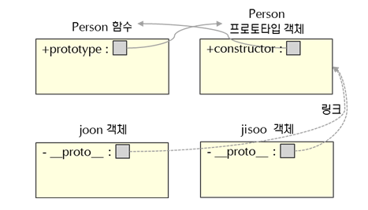

✅ JavaScript는 `Prototype` 기반 객체지향 언어

→ 기존의 객체를 <u>복사(Cloning)</u>하여 새로운 객체를 생성함

## Prototype

> 다른 객체에 대한 참조

- 모든 JavaScript 객체는 원형이 되는 `Prototype`을 가짐
  - 이를 통해 `상속`을 구현
- 모든 객체는 `__proto__` 라는 `내부 property` 를 가지고, 이는 `Prototype`이 되는 객체를 가리킴
- 기본적으로 모든 객체는 `Object`를 `Prototype`으로 가짐
  - 따라서 모든 객체에서 Object 내에 정의된 메소드나 속성들을 사용할 수 있음

### Prototype의 동작

```jsx
// 비어있는 Person 함수
function Person() {}

var joon = new Person();
var jisoo = new Person();
```

- 위의 함수가 실행되어 parsing될 때, Person 함수의 `prototype` 속성은 해당 함수의 `Prototype 객체`를 참조
- 그리고 `Prototype 객체`의 `constructor` 속성은 위의 `Person` 함수를 참조
- 이렇게 생성된 `Prototype 객체`는 `new`와 `Person` 함수를 통해 생성된 모든 객체의 원형이 되는 `Prototype`이 됨



### 장점

- 공통 되는 부분을 Prototype에 정의하고, 이를 상속하여 재사용성을 높이고, 메모리를 절약할 수 있음

### 단점

- Prototype chain이 복잡해지면서 속성을 찾는 과정이 복잡해져 예상치 못하게 동작할 수 있음
  - 예측성, 안정성이 비교적 떨어질 수 있음
- Prototype이 동적으로 변경될 수 있기 때문에 이미 생성된 다른 객체들에도 영향을 미칠 수 있어 예상치 못한 동작이 발생할 수 있음
