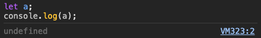
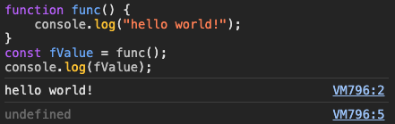
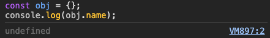
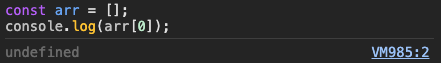
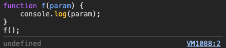

# ` undefined` vs `null` vs `NaN`

디프만을 하기 전에 토스뱅크 면접을 보면서 `undefined`와 `null`의 차이에 대한 면접 질문을 받았었다.

정말 상상도 못했던 질문이라 당황하였지만, 다음과 같이 답변하였다.

`undefined`는 말그대로 아직 정의되지 않은 상태로, 자바스크립트에서 변수를 **초기화**하는 과정에서 메모리를 할당하고 실질적이 값이 할당되지 않은 상태에 해당하는 값이라고 설명하였다. <br/>
그리고 `null`은 비어있는 값, 즉, 변수가 선언되었지만 의도적으로 아무런 값이 없는 상태라고 설명하였다. <br/>

면접관분들도 고개를 끄덕이며 스무스하게 넘어가서 크게 짚고 넘어가지 않았었는데, 이론만 알고 실질적인 차이를 모르면 무슨 의미일까라는 생각이 문득 들어 주제로 정하였다.

아래 사진은 `null`과 `undefined`에 대한 차이를 설명할 때 예시로 가장 많이 드는 사진이라고 한다.


## undefined

> 변수를 선언하고 값이 할당되지 않은 상태

즉, 아직 값이 할당되지 않았거나 어떤 속성이 객체 안에 존재하지 않는 경우를 말한다. <br/>
우리는 다음과 같은 경우에 `undefined`를 볼 수 있다.

- 변수에 값을 할당하지 않았을 때 <br/>
  
- 함수가 값을 반환하지 않았을 때 <br/>
  
- 객체에 없는 속성에 접근 <br/>
  
- 배열에 존재하지 않는 인덱스에 접근 <br/>
  
- 함수의 파라미터로 전달되지 않은 인수 <br/>
  

## null

> 변수를 선언하고 비어있는 값을 할당한 상태 (비어있는 객체)

즉, 개발자가 의도적으로(명시적으로) **값이 없음**을 표현하는 것이다. <br/>
또한 해당 변수가 만약 객체에 대한 변수라면, `null`은 변수가 **아무 것도 참조하지 않음**을 의미한다. <br/>
이 말은 즉슨 **아무 주소값을 가지고 있지 않다**는 말이기도 하다.

## NaN

> Not a Number (숫자가 아닌 값)

Number 타입에 숫자가 아닌 잘못된 값이 들어간 경우이다. <br/>
즉, 수학 연산을 거쳤지만 유효하지 않은 결과로 인해 반환되는 값이다. <br/>
말그대로 수학 연산에 인자로 문자가 들어가거나 문자를 숫자로 캐스팅하는 경우에 볼 수 있다.

## 공통점은 뭘까?

이 3가지 값들의 공통점은 `boolean`으로 다뤘을때 모두 `false`를 의미한다는 것이다. <br/>
따라서 이 모두를 한번에 처리해야한다면, 조건문에서 not 연산자인 `!`를 이용하여 편리하게 걸러줄 수 있다.

하지만, `false`와 직접 비교를 한다면 항상 거짓이 나온다. <br/>
`===` 뿐만 아니라 `==`도 말이다.

```
undefined == false // false
null == false      // false
NaN == false       // false
```

물론 이 3가지 값 간 비교에서도 모두 거짓이 나온다.

```
undefined == null // false
null == NaN       // false
NaN == undefined  // false
```

## 그럼 차이점은?

3가지 값은 타입이 다르다. <br/>
이것은 `typeof`를 통해 확인할 수 있다.

```javascript
console.log(typeof undefined); // undefined
console.log(typeof null); // object
console.log(typeof NaN); // number
```

`undefined`는 string, number 등과 같은 **원시 타입(Primitive Type)**으로 존재하는 `undefined` 타입이다. <br/>
JavaScript의 변수 선언 과정을 살펴보면, `선언 - 초기화 - 할당`으로 이루어진다. <br/>
이 중, 초기화 단계에서 **확보된 메모리를 `undefined`로 초기화**하는 과정을 거치는데 이때 필요하기 때문에 `undefined`를 원시 타입으로 지정한 것이 아닐까 싶다.

그리고 `null`은 **빈 값**이기 때문에 자료형이 없는 상태가 맞지만, 초기 JavaScript 설계에서 객체로 구현되어 버그지만 수정되지 않았다고 한다.

마지막으로 `NaN`은 머리로는 알지만 명쾌한 설명을 못하겠는..데, 지선생님피셜 특별한 유형의 부동 소수점 숫자로 간주되어 number 타입이라고 한다. <br/>
그냥 수학 연산의 결과는 당연히 숫자가 되어야하지만 오류가 발생하여 숫자가 아닌 값을 뜻하는 숫자가 아닌 유일한 number 타입이라고 생각하자.

추가적으로 null과 undefined는 메모리 상에서도 차이가 존재한다고 한다. <br/>
undefined는 초기화되지 않은 변수에 대해 자동으로 할당되기 때문에 값이 매우 작다. <br/>
하지만, null의 경우, 말그대로 변수에 값이 없음을 의미하기 때문에 언제라도 값이 들어올 수 있어 undefined보다는 큰, 최소한 주소값의 크기에 해당하는 메모리를 차지한다. <br/>
그래도 사실 그렇게 큰 차이는 없을 것 같다. <br/>
C에서도 포인터에 대한 메모리 크기와 실제 int, char 등의 지정된 타입에 대한 메모리 크기 사이에는 차이가 있기는 하지만 엄청 큰 차이는 나지 않기 때문에 JavaScript에서도 이정도 차이지 않을까 싶다. <br/>
(Java도 참조 변수는 메모리가 얼마라 했던 것 같은데 기억이 잘 나질 않는다.)

## 느낀 점

오랜만에 면접을 다시 대비를 하려고 공부하니 은근히 재미가 있었다. <br/>
면접을 다시 복기해보니 CS에 대한 질문은 그래도 나쁘지 않게 했던 것 같은데, 프로젝트나 프론트엔드 지식에 대해서는 많이 부족했던 것 같다. <br/>
하나씩 차근차근 잘 준비해봐야겠다는 생각을 했다.
