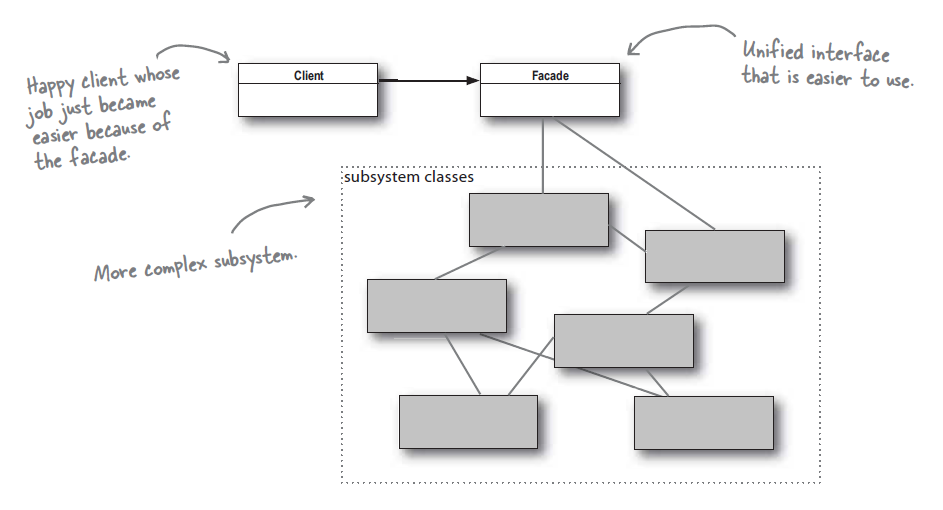

**:white_check_mark: ChatGPT 요약**   
이 글은 Adapter Pattern과 Facade Pattern에 대해 설명합니다. Adapter Pattern은 기존 클래스를 클라이언트가 요구하는 새로운 인터페이스로 변환하여 재사용성을 높입니다. Facade Pattern은 복잡한 서브시스템을 단순화된 고수준 인터페이스로 묶어 클라이언트가 쉽게 사용할 수 있도록 돕습니다. 두 패턴의 차이점과 사용 사례를 통해 각 패턴의 활용 방법을 이해할 수 있습니다.
<!-- truncate -->
<br></br>


## Adapter Pattern은 무엇인가?

> Apapter Pattern은 특정 클래스 인터페이스를 클라이언트에서 요구하는 다른 인터페이스로 변환한다.

Adapter Pattern은 다이어그램 속 Adapter Class를 이용해 Adaptee 클래스를 Target 인터페이스를 이용할 수 있도록 변환한다. 
이때 Adapter 클래스는 구성(Composite)을 통해 Adaptee를 가지며 Adaptee를 활용해 Target 메서드를 구현한다. 이 패턴을 이용하면 기존에 사용하던 클래스를 신규로 요구되는 인터페이스에 맞춰 기능을 제공할 수 있다.
<br></br>

### 코드로 알아보는 Adapter Pattern 
```java
public interface Turkey {
    void gobble();
    void fly();
}

public class WildTurkey implements Turkey {
    @Override
    public void gobble() {
        System.out.println("골골");
    }

    @Override
    public void fly() {
        System.out.println("칠면조 날다!");
    }
}
```
기존에 Turkey 인터페이스와 WildTurkey 구현체가 있었다고 가정해보자.
<br></br>

```java
public interface Duck {
    void quack();
    void fly();
}
```
그러던 어느 날 Duck 인터페이스가 신규로 만들어지고 Duck 형태로 Client에게 기능을 제공할 일이 생겼다면?
이런 상황에서 Duck 구현체를 만들 수도 있지만 Adapter 패턴을 이용하면 기존 Duck 구현체를 활용해 Client가 원하는 Turkey 인터페이스 형태로 제공할 수 있다.
<br></br>

```java
public class TurkeyAdapter implements Duck {
    private Turkey turkey;

    public TurkeyAdapter(Turkey turkey) {
        this.turkey = turkey;
    }

    @Override
    public void quack() {
        turkey.gobble();
    }

    @Override
    public void fly() {
        IntStream.range(0, 5).forEach(i -> turkey.fly());
    }
}
```
TurkeyAdapter는 Turkey를 구성(Composite)하여 Duck 인터페이스를 지원하는 용도이다. 
Adapter를 이용하면 장점이 기존 코드를 Client가 원하는 인터페이스 형태로 변환하여 제공할 수 있고, Turkey 인터페이스의 모든 구현체가 이용할 수 있다. 

## Facade Pattern은 무엇인가?

> Facade Pattern은 서브시스템에 있는 일련의 인터페이스를 통합 인터페이스로 묶어 준다.  
> 즉, Facade 클래스를 통해 고수준의 인터페이스를 제공해 Client가 보다 쉽게 Sub System 클래스들을 이용할 수 있도록 돕는다.

Facade Pattern은 복잡한 Sub System 클래스 사용 방식을 단순화해 클라이언트에 제공하는 Pattern이다. 
여러 클래스에 걸쳐 복잡한 로직을 수행해야 한다면 Facade Pattern을 사용하여 복잡한 로직을 고수준 인터페이스로 단순화하여 Client에 제공할 수 있다.
<br></br>

### 코드로 살펴보는 Facade Pattern
```java
// Sub System 클래스들..

public class Amplifier {
    public void on() {
        ...
    }

    public void off() {
        ...
    }
}

public class Projector {
    public void on() {
        ...
    }

    public void wideScreenMode() {
        ...
    }

    public void off() {
        ...
    }
}

public class Screen {
    public void down() {
        ...
    }

    public void up() {
        ...
    }
}

public class StreamingPlayer {
    public void play(String movie) {
        ...
    }

    public void on() {
        ...
    }

    public void off() {
        ...
    }
}
```
위의 Sub System 클래스들은 홈 시어터를 구성하는 요소들이다. 만약 Client가 Sub System 클래스들을 바탕으로 영화를 시청하려면 모든 클래스의 의존해야 한다. 
또한 영화를 틀기 위한 Sub System 사용 로직도 Client가 구현하고 있어야 한다.
<br></br>

```java
public class HomeTheaterFacade {
    private final Screen screen;
    private final Projector projector;
    private final StreamingPlayer player;
    private final Amplifier amplifier;

    public HomeTheaterFacade(Screen screen, Projector projector, StreamingPlayer player, Amplifier amplifier) {
        this.screen = screen;
        this.projector = projector;
        this.player = player;
        this.amplifier = amplifier;
    }

    public void watchMovie(String movie) {
        System.out.println("영화 시청을 준비합니다.");
        screen.down();
        projector.on();
        projector.wideScreenMode();
        amplifier.on();
        player.on();
        player.play(movie);

    }

    public void endMovie() {
        System.out.println("영화 시청을 종료합니다.");
        player.off();
        amplifier.off();
        projector.off();
        screen.up();
    }
}
```
하지만 Facade 클래스를 사용하면 Client 측에서는 좀 더 편리하게 원하는 동작(영화 보기, 영화 끄기)을 수행할 수 있게 된다. 
Facade Pattern에서 Client가 꼭 Facade 클래스를 통해 Sub System 클래스에 접근해야 하는 건 아니다. 
각 클래스에 특화된 기능을 이용하고 싶다면 필요한 Sub System 클래스를 의존하고 사용하면 된다.

### 최소 지식 원칙
Facade Pattern을 통해 배울 수 있는 디자인 원칙 중 하나는 최소 지식 원칙이다. 지식을 클래스와 클래스 활용법 정도로 대입해 생각하면 이해가 쉽다. 
즉, 클래스 간의 의존성은 꼭 필요한 것만 최소한으로 가지는 것이 좋다는 의미이다. 이 규칙을 지키기 위한 4가지 원칙이 있는데 아래와 같다.
- 객체 자신은 이용해도 된다.
- 메소드에 매개변수로 전달된 객체는 이용해도 된다.
- 메소드를 생성하거나 인스턴스를 만든 객체는 이용해도 된다.
- 객체에 속하는 구성 요서는 이용해도 된다.
<br></br>


위 원칙은 간단하면서도 지키기 어려울 것 같은데 4가지 원칙을 의식하면서 코드를 짜봐야겠다. 단, 의존성을 줄이고 메서드를 쪼개는 작업은 언제나 시스템을 보다 복잡하게 만들 수 있다는 점을 잊지 말자.


## Adapter Pattern vs Facade Pattern
책에서 두 패턴을 한 챕터에서 다룬 이유는 두 패턴이 모두 클래스를 감싸서 새로운 인터페이스를 제공한다는 공통점이 있기 때문이다. 하지만 두 패턴의 차이는 사용 용도에 있다는 점을 유념하자. 
Adapter Pattern은 기존 클래스를 신규 인터페이스에 맞게 제공하기 위한 용도이다. 반면 Facade Pattern은 편리하게 사용할 수 있는 고수준 인터페이스를 제공함과 동시에 Client와 Sub System Class들의 의존성을 끊어두기 위해 사용한다.