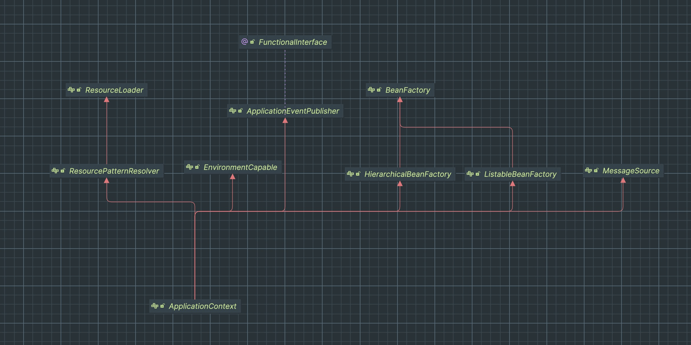

## Spring IoC, DI, IoC Container 그리고 ApplicationContext
---
Spring IoC는 스프링 프레임워크의 핵심이다. IoC란 Inversion of Control의 약어로 메서드나 객체에 대한 제어권을 외부로 넘기는 것이다.
이와 관련된 용어로 DI는 의존성 주입을 뜻하며 Spring에서는 DI를 통해 IoC를 달성하며 IoC의 구체화된 형태가 DI이다.   
<br></br>


제어권을 넘겨 받는 주체가 누구인지 또한 중요한데 이 주체가 IoC Container이다. 공식 문서에서는 ApplicationContext를 IoC Container라 부른다.
위 다이어그램은 ApplicationContext의 의존 관계를 보여주는데 다양한 interface를 상속하기 때문에 다양한 기능을 제공한다고 이해할 수 있다. 
ApplicationContext 즉, IoC Container가 수행하는 중요한 작업 중 하나는 Spring Bean들을 초기화/조립/구성하는 역할이다. 
Bean들을 초기화하기 위해서는 개발자가가 작성한 객체들과 Configuration Metadata가 필요한데 Configuration Metadata를 작성하는 방식에 따라 ApplicationContext의 구현체가 달라진다. (Configuration Metadata 구성 방식만이 ApplicationContext의 구현 종류를 결정하는 건 아니다.)  
<br></br>

## Annotation 기반의 ApplicationContext
---
``` java
@SpringBootApplication
public class SpringCoreApplication {
    public static void main(String[] args) {
        SpringApplication.run(SpringCoreApplication.class, args);
    }

    @Bean
    public ApplicationRunner runner(ApplicationContext applicationContext) {
        return (args) -> {
            System.out.println(applicationContext.getClass());
        };
    }
}

// class org.springframework.context.annotation.AnnotationConfigApplicationContext
// spring-boot-starter-web 의존성 추가 후 -> class org.springframework.boot.web.servlet.context.AnnotationConfigServletWebServerApplicationContext
```
그 중에서 가장 많이 사용되는 구현체는 Annotation 기반의 ApplicationContext이다. 
spring boot를 활용해 application을 실행하면 default로 적용되는 ApplicationContext이 `AnnotationConfigApplicationContext`이다. 
또한 spring-boot-starter-web 의존성을 추가하고 application을 실행하면 default로 `AnnotationConfigServletWebServerApplicationContext`이 적용된다.
이 둘의 공통점은 Annotation을 기반으로 Configuration Metadata를 식별하여 ApplicationContext가 동작한다는 점이다.
<br></br>

### (1) register(...): Bean 등록 메서드
---
``` java
public interface AnnotationConfigRegistry {
    void register(Class<?>... componentClasses);

    void scan(String... basePackages);
}
```
Annotation 기반의 ApplicationContext들은 위 interface를 구현하고 있다. 위 메서드 중 `void register(...)`는 Bean을 등록할 때 사용되는 메서드이다.
Spring Boot 기반으로 Application을 만들 때 대개 @Component나 @Bean 어노테이션을 기반으로 Bean을 등록한다. 하지만 @Component나 @Bean 기반으로 Bean을 등록할 때 이 메서드가 사용되지는 않는다.
다만 Annotation기반의 Metadata를 활용해 Bean을 등록하는 과정을 살펴볼 수 있다. 구현체들 중 AnnotationConfigApplicationContext를 기반으로 `void register(...)`구현을 살펴보자.   
<br></br>

```java
@SpringBootApplication
public class SpringCoreApplication {

    public static void main(String[] args) {
        SpringApplication.run(SpringCoreApplication.class, args);
    }

    @Bean
    public ApplicationRunner runner(AnnotationConfigApplicationContext applicationContext ) {
        return (args) -> {
            applicationContext.register(TestService.class);
        };
    }
}
```
위 코드의 `applicationContext.register(TestService.class)`코드를 디버깅해보면 결국 AnnotatedBeanDefinitionReader 클래스의 doRegisterBean(...) 메서드를 만나게 된다.
<br></br>

```java
public class AnnotatedBeanDefinitionReader {
    private final BeanDefinitionRegistry registry;
    private BeanNameGenerator beanNameGenerator;
    private ScopeMetadataResolver scopeMetadataResolver;
    private ConditionEvaluator conditionEvaluator;
    
    ... 생략

    private <T> void doRegisterBean(Class<T> beanClass, @Nullable String name, @Nullable Class<? extends Annotation>[] qualifiers, @Nullable Supplier<T> supplier, @Nullable BeanDefinitionCustomizer[] customizers) {
        AnnotatedGenericBeanDefinition abd = new AnnotatedGenericBeanDefinition(beanClass);
        if (!this.conditionEvaluator.shouldSkip(abd.getMetadata())) {
            ... 생략
        
        
            // Class의 Annotation을 기반으로 BeanDefinition을 Update한다.
            AnnotationConfigUtils.processCommonDefinitionAnnotations(abd);
            
            ... 생략

            BeanDefinitionHolder definitionHolder = new BeanDefinitionHolder(abd, beanName);
            definitionHolder = AnnotationConfigUtils.applyScopedProxyMode(scopeMetadata, definitionHolder, this.registry);
            BeanDefinitionReaderUtils.registerBeanDefinition(definitionHolder, this.registry);
        }
    }
}
```
`doRegisterBean(...)`의 로직을 간략하게 설명하면 Bean으로 등록할 Class의 Annotation 정보들을 기반으로 BeanDefinition을 설정한 후 beanName과 alias 정보들을 함께 가지는 BeanDefinitionHolder로 변환하여 등록한다. 
이때 Class의 Annotation을 기반으로 BeanDefinition을 Update하는 로직을 타고 들어가면 아래 메서드를 만날 수 있다.  
<br></br>
```java
public abstract class AnnotationConfigUtils {
    ... 생략

    static void processCommonDefinitionAnnotations(AnnotatedBeanDefinition abd, AnnotatedTypeMetadata metadata) {
        AnnotationAttributes lazy = attributesFor(metadata, Lazy.class);
        if (lazy != null) {
            abd.setLazyInit(lazy.getBoolean("value"));
        } else if (abd.getMetadata() != metadata) {
            lazy = attributesFor(abd.getMetadata(), (Class)Lazy.class);
            if (lazy != null) {
                abd.setLazyInit(lazy.getBoolean("value"));
            }
        }

        if (metadata.isAnnotated(Primary.class.getName())) {
            abd.setPrimary(true);
        }

        AnnotationAttributes dependsOn = attributesFor(metadata, DependsOn.class);
        if (dependsOn != null) {
            abd.setDependsOn(dependsOn.getStringArray("value"));
        }

        AnnotationAttributes role = attributesFor(metadata, Role.class);
        if (role != null) {
            abd.setRole(role.getNumber("value").intValue());
        }

        AnnotationAttributes description = attributesFor(metadata, Description.class);
        if (description != null) {
            abd.setDescription(description.getString("value"));
        }

    }
    
    ... 생략
}
```
메서드를 보면 Lazy, Primary 등 친숙한 클래스를 만날 수 있다. 이 메서드에서 어노테이션을 기반으로 AnnotatedBeanDefinition 설정 값들을 수정하는 것을 확인할 수 있다. 
다시 처음으로 돌아가서 간략하게 정리하자면 AnnotationConfigApplicationContext의 register(...) 메서드는 매개변수로 받은 Class를 Bean으로 등록한다. 정확히는 DefaultListableBeanFactory클래스의 `private final Map<String, BeanDefinition> beanDefinitionMap` 필드에 beanName과 BeanDefinition을 key와 value로 등록한다. 
더 정확히는 BeanDefinition만 등록하지 초기화는 발생하지 않는다. IoC Container에 Singleton Bean을 초기화하는 작업은 해당 Bean을 조회할 때 발생하며 AbstractBeanFactory의 doGetBean(...)를 통해 초기화 된다.
<br></br>

## 정리
---
생각보다 오랜 시간 디버깅을 통해 알아보았다. 긴 시간을 들여 알게 된 사실을 요약해보자면 아래와 같다.
1. Spring Boot의 SpringApplication.run(...) 메서드를 실행하면 약 60여개의 Bean들이 자동으로 등록된다.
2. Default ApplicationContext(IoC Container)는 AnnotationConfigApplicationContext이며 spring-boot-stater-web 의존성을 추가하면 AnnotationConfigServletWebServerApplicationContext가 Default이다.
3. 작성한 Object와 Configuration Metadata를 조합하여 ApplicationContext(IoC Container)는 Bean을 구성한다.
   - Default로 Configuration Metadata는 Annotation으로 구성되지만 XML, Groovy 등으로 작성될 수도 있다.
4. Bean이 등록되는 시점과 방식은 다양하다.
   - AnnotationConfigApplicationContext.register(...)로 Bean을 등록하는 것과 @Component나 @Bean으로 Bean을 등록하는 건 등록되는 시점과 방식이 모두 다르다.
5. 당연하지만 등록된 BeanDefinition과 그리고 Singleton Object는 따로 관리된다.  
<br></br> 

Spring을 깊이 알아보고자 Annotation 기반의 ApplicationContext가 register(...) 메서드로 Bean을 등록하는 과정을 살펴봤다. 요즘들어 `효율성`이란 단어가 자주 머리에 맴돈다. 
효율성은 생산성과 직결돠고 이는 곧 결과로 나타난다. 때문에 학습에서도 효율적인 방법인지를 고민하게 되는 것 같다. 특히 이런 학습은 무언가를 만들어냈을 때와는 다르게 당장의 결과물이 없다.  
또한 당장의 업무나 개발을 위한 학습도 아니기에 언제 어떻게 어떤 방식으로 도움이 될지도 미지수이다. 그렇기에 효율성이란 단어가 머리를 맴돌지 않나 싶다. 
하지만 Spring의 내부를 살펴보는 일을 이제 막 시작한 단계에서 `효율성`을 생각하는 건 욕심이 아닌가 싶다. 일단 계속 시간을 들여봐야겠다.