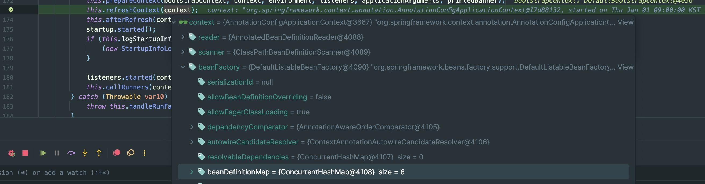
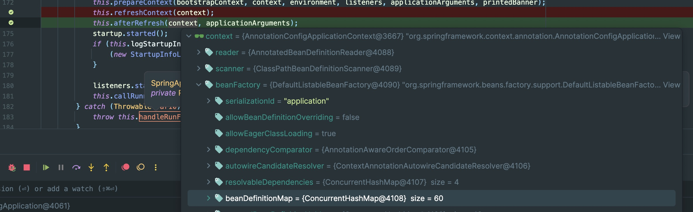

Annotation 기반의 ApplicationContext은 Bean을 어떻게 등록할까? (2)
<!-- truncate -->
<br></br>

## @Component가 붙은 클래스는 어떻게 Bean으로 등록될까?
---

[Annotation 기반의 ApplicationContext Bean 등록 과정 파헤치기 (1)](https://egg528.github.io/annotation-config-application-context) 글에서 AnnotationConfigApplicationContext.register(...) 메서드가 매개변수로 받은 클래스를 어떻게 Bean으로 Container에 등록하는지 알아봤다. 
하지만 대개 작성한 클래스를 Bean으로 등록할 때는 register(...) 메서드를 직접 사용하기보다는 @Component를 Class에 붙이거나 @Configuration 클래스 내 메서드에 @Bean을 붙여서 사용한다. 이 경우에 ApplicationContext(IoC Container)에 Bean으로 등록되는 과정을 알아보려 한다.
<br></br>


```java
// SpringCoreApplication 파일
public static void main(String[] args) {
        SpringApplication.run(SpringCoreApplication.class, args);
}

// SpringApplication.run(..)을 타고 들어가다 보면
public ConfigurableApplicationContext run(String... args) {
    try {
        ...
        
        this.refreshContext(context);
        
        
    }
    ...
}
```
<br></br>

*refreshContext(...) 이전*
<br></br>

*refreshContext(...) 이후*

Spring Boot의 시작과 끝. SpringApplication.run()을 타고 들어가다보면 `run(String... args)` 메서드를 만날 수 있다. 
이 메서드는 짧지 않은데 디버깅을 해보면 refreshContext(...) 메서드 동작 전후로 beanFactory 필드 내 beanDefinitionMap의 데이터 수가 달라지는 것을 확인할 수 있다. 
즉, refreshContext(...)에서 Bean 등록이 이루어 이루어진다고 볼 수 있으니 refreshContext(...)를 살펴보자.
(Singleton 객체들의 초기화가 이루어지는 것은 아니다.)    


## refreshContext(...) 속으로 
---
```java
public abstract class AbstractApplicationContext extends DefaultResourceLoader implements ConfigurableApplicationContext {

    public void refresh() throws BeansException, IllegalStateException {  
        ...
        
        // (1) ComponentScan + BeanDefinition 등록 
        this.invokeBeanFactoryPostProcessors(beanFactory);
        
        // (2) 사용자 정의 + Default BeanPostProcessor를 AbstractBeanFactory - beanPostProcessors 필드에 추가
        this.registerBeanPostProcessors(beanFactory); 
        
        ...
        
        // (3) BeanPostProcessor 동작 및 Bean 초기화
        this.finishBeanFactoryInitialization(beanFactory);
        
        ...
    }
}
```
refresh(...) 메서드 내부에서는 정말 많은 일이 일어난다. 하지만 이 글의 목적인 Bean 등록 과정에 초점을 맞춰 살펴보자. 
(1) 메서드에서는 ComponentScan과 함께 BeanDefinition 등록이 일어난다. 이후 (2) 메서드에서는 등록된 BeanDefinition들 중 BeanPostProcessor를 추려내 따로 보관한다. 마지막으로 알아볼 
(3) 메서드에서는 BeanProcessor를 활용해 SingletonBean들을 초기화하는 작업이 일어난다. 각 메서드를 조금 더 자세히 살펴보자.
<br></br>


### Component Scan과 BeanDefinition 등록
```java
public class ConfigurationClassPostProcessor implements BeanDefinitionRegistryPostProcessor, BeanRegistrationAotProcessor, BeanFactoryInitializationAotProcessor, PriorityOrdered, ResourceLoaderAware, ApplicationStartupAware, BeanClassLoaderAware, EnvironmentAware {

    public void processConfigBeanDefinitions(BeanDefinitionRegistry registry) {  
        ...   
        
        parser.parse(candidates);  // (1)
        
        ...
        
        this.reader.loadBeanDefinitions(configClasses);  // (2) 
        
        ...
    }
}
```
processConfigBeanDefinitions(...) 메서드에서 정말 많은 동작이 일어나지만 두 메서드가 핵심이다. (1) base package 하위의 모든 파일을 가져온 후 Filtering을 시작하는데 이 과정에서 @Component나 @ManagedBean이 붙은 클래스를 추려낸다. 
이후 (2) 추려낸 class들(configClasses)을 기반으로 Bean들을 생성한다. 이때 @Bean이 붙은 메서드도 식별을 한다. 이후 DefaultListableBeanFactory의 beanDefinitionMap에 Bean을 등록한다. 단, 아직 Singleton Bean을 초기화하는 건 아니다.    
<br></br>


### BeanPostProcessor 등록
```java
final class PostProcessorRegistrationDelegate {
    ...
    
    public static void registerBeanPostProcessors(ConfigurableListableBeanFactory beanFactory, AbstractApplicationContext applicationContext) {  
        String[] postProcessorNames = beanFactory.getBeanNamesForType(BeanPostProcessor.class, true, false);  // (1)
        
        ...
        registerBeanPostProcessors(beanFactory, (List)priorityOrderedPostProcessors);  // (2)
        
        ...
        registerBeanPostProcessors(beanFactory, (List)orderedPostProcessors);  // (2)
        
        ...
        registerBeanPostProcessors(beanFactory, (List)nonOrderedPostProcessors);  // (2)
        
        ...
        registerBeanPostProcessors(beanFactory, (List)internalPostProcessors);  // (2)
        
        ... 
    }
    ...
}
```
BeanPostProcessor를 등록하는 로직은 간단하다. (1)에서 BeanPostProcessor class 타입의 beanName들을 beanFactory에서 조회한다.
이후 BeanPostProcessor들을 분류하여 (2) 메서드들에서 AbstractBeanFactory - beanPostProcessors 필드에 추가하여 보관한다.
<br></br>

### BeanPostProcessor 동작 및 Bean 초기화
```java
public class DefaultListableBeanFactory extends AbstractAutowireCapableBeanFactory implements ConfigurableListableBeanFactory, BeanDefinitionRegistry, Serializable {
    ...

    public void preInstantiateSingletons() throws BeansException {
		...

        List<String> beanNames = new ArrayList(this.beanDefinitionNames);  // (1)
        Iterator var2 = beanNames.iterator();

        String beanName;
        while (var2.hasNext()) {
            beanName = (String) var2.next();
            RootBeanDefinition bd = this.getMergedLocalBeanDefinition(beanName); // (2)
            if (!bd.isAbstract() && bd.isSingleton() && !bd.isLazyInit()) {  // (3)
                if (this.isFactoryBean(beanName)) {
                    Object bean = this.getBean("&" + beanName);
                    if (bean instanceof SmartFactoryBean) {
                        SmartFactoryBean<?> smartFactoryBean = (SmartFactoryBean) bean;
                        if (smartFactoryBean.isEagerInit()) {
                            this.getBean(beanName);  // (4)
                        }
                    }
                } else {
                    this.getBean(beanName);  // (4)
                }
            }
        }
    }
}
```
마지막으로 BeanPostProcessor를 활용해 Singleton Bean을 초기화하는 로직을 살펴보자.우선 (1) 메서드에서 등록된 beanName들로 List를 만들고 이를 순회한다.
(2) beanName으로 AbstractBeanFactory의 mergedBeanDefinitions에서 RootBeanDefinition을 조회하고 (3) 해당 bean의 추상 여부, 싱글톤 스코프 여부, 지연 초기화 여부를 확인한다.
마지막으로 (4)에서 Bean을 초기화하여 Map에 보관하고 초기화 이전 이후로 적용되어야 할 BeanPostProcessor가 동작한다.   
<br></br>

```java
public abstract class AbstractAutowireCapableBeanFactory extends AbstractBeanFactory implements AutowireCapableBeanFactory {
    ...
    protected Object initializeBean(String beanName, Object bean, @Nullable RootBeanDefinition mbd) {  
        this.invokeAwareMethods(beanName, bean);  
        Object wrappedBean = bean;  
        
        if (mbd == null || !mbd.isSynthetic()) {  
            wrappedBean = this.applyBeanPostProcessorsBeforeInitialization(bean, beanName);  // (1)
        }  
        
        try {  
            this.invokeInitMethods(beanName, wrappedBean, mbd);  // (2)
        } catch (Throwable var6) {  
            throw new BeanCreationException(mbd != null ? mbd.getResourceDescription() : null, beanName, var6.getMessage(), var6);  
        }
          
        if (mbd == null || !mbd.isSynthetic()) {  
            wrappedBean = this.applyBeanPostProcessorsAfterInitialization(wrappedBean, beanName); // (3)  
        }
          
        return wrappedBean;  
    }
    ...
}
```
getBean(...) 메서드를 조금 더 파고 들어가보면 initializeBean(...) 메서드를 만날 수 있다. 메서드명만 봐도 동작을 쉽게 유추할 수 있다.   
(1) BeanPostProcessor의 postProcessBeforeInitialization(...) 동작  
(2) Bean의 InitMethod 동작  
(3) BeanPostProcessor의 postProcessAfterInitialization(...) 동작  
<br></br>   


## 정리
---
AnnotationConfigApplicationContext를 사용해 SpringApplication.run(...)을 실행했을 때 Annotation 정보들을 기반으로 어떻게 Java객체가 ApplicationContext(IoC Container)에 등록되는지 알아보았다.
기존에도 동일한 방식으로 Spring Application을 개발하고 있었으니 코드를 파고 들어가보기 전에도 어떤 방식으로 동작한다는 알고 있었고 새로운 내용들은 아니었다. 하지만 코드를 파악하며 동작 방식을 파악하는 건 생각처럼 쉬운 일은 아니었다.
특히 IntelliJ가 .class 파일을 decompile하는 과정에서 변수명들이 varxx 형식으로 변환되거나 원래 구문과 동작만 동일한 방식으로 코드가 보여져 읽기 쉽지 않았다. (github에서 spring repo를 다운받아서 봐야겠다...)
소스 코드를 따라 동작 방식을 눈으로 확인하고 나니 재미도 있었고 SpringApplication이 뜰 때까지 마냥 기다림의 시간이었는데, 지금 뭘 하고 있겠구나 하는 생각이 들기도 한다. 
하지만 재미도 재미지만 한편으로 이 학습의 결과가 어딘가에서 효과를 발휘할 수 있었으면 좋겠다는 생각도 남는다.