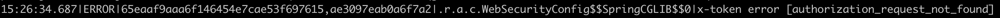
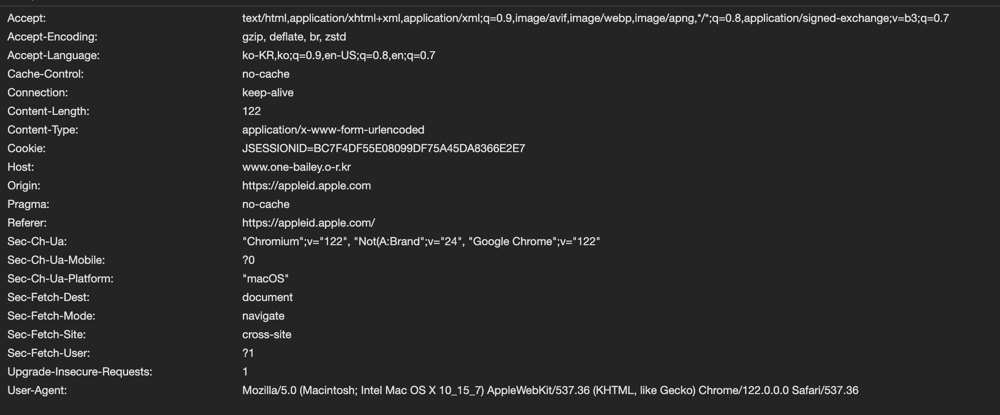
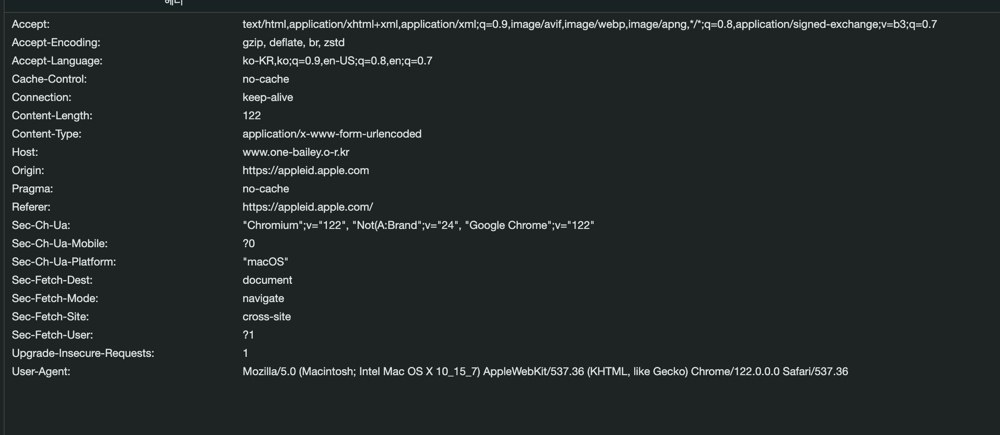
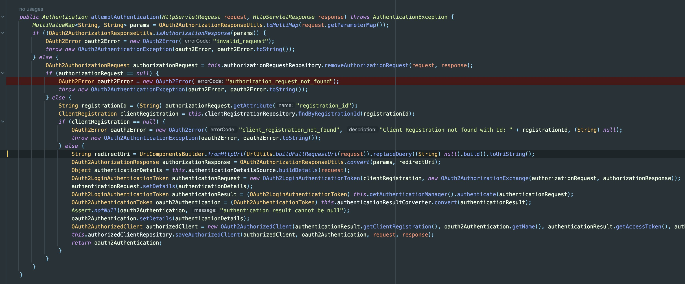
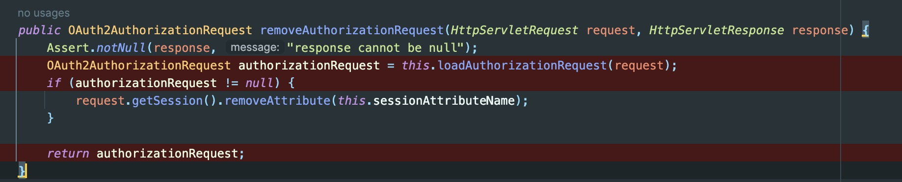

# Spring Security `authorization_request_not_found` 오류를 잡아보자

## 문제 상황

- 애플 로그인을 연결한 이후로 이상한 케이스들이 발생했다. 
- 사진과 같은 error log가 남으며 oauth login인 제대로 되지 않는 상황..
- 애플 로그인에서만 발생한다고 생각했지만, 구글 / 카카오 로그인에서도 발생하고 있다는 제보를 받았다.

## 문제 인식
### 1. 로그인 성공 / 실패 케이스의 Request Header 비교

- OAuth 로그인의 경우 사용자가 소셜 로그인을 마친 후 redirect-uri로 redirect된다.
- 위 사진은 redirect url로 요청을 보낼 때 browser에서 capture한 request header 정보이다.
- Cookie값을 보면 JESSIONID값이 존재하는 것을 확인할 수 있다.
- JESSIONID는 servlet에서 설정하는 session id의 key값이다.



- 실패한 경우에는 session id값이 request header값에 없는 것을 확인할 수 있다.

### 2. 오잉? Spring Security 설정으로 Session값을 사용하지 않도록 해뒀는데?
```java
.sessionManagement { it.sessionCreationPolicy(SessionCreationPolicy.STATELESS) }
```
- 위 코드는 SecurityFilterChain을 설정하는 코드의 일부이다.
- 이때 SessionCreationPolicy를 통해 Spring Security 프레임워크 내부에서 세션 생성 시점과 세션 사용 방식을 관리할 수 있다.
- STATELESS는 프레임워크 내부에서 session을 생성하지 않고 session을 사용하지 않는 설정값이다.
  - 단, Spring Security 내부에서 session 생성하지 않는 것이기 때문에 servlet 즉 application에서는 session을 생성한다.
  - 하지만 Spring Security에서 session을 사용하지 않도록 설정했는데 session값이 문제의 원인일 수 있는 건가..?

### 3. 디버깅 -> 오류 지점 확인

- 위 코드는 Spring Security 프레임워크 내부에 존재하는 OAuth2LoginAuthenticationFilter 클래스의 attemptAuthentication() 메서드이다.
- 오류가 발생한 지점은 빨간 라인이다. 
- 해당 오류는 this.authorizationRequestRepository.removeAuthorizationRequest()의 반환값이 null일 경우 발생한다.

### 4. this.authorizationRequestRepository.removeAuthorizationRequest()
- Spring Security는 authorizationRequestRepository의 기본값으로 HttpSessionOAuth2AuthorizationRequestRepository를 주입한다.
- 이름에서부너 Session을 활용할 것 같다는 냄새가 난다.

- loadAuthorizationRequest()가 핵심이다.
- request의 Session에서 sessionAttributeName(DEFAULT_AUTHORIZATION_REQUEST_ATTR_NAME)을 key로 가지는 Attribute를 조회하고, 삭제한다.
- 이 동작을 보면 크게는 아래와 같은 동작이 있었을 것으로 추정된다.
  - 소셜 로그인 버튼을 클릭해서 처음 backend-server로 요청이 들어올 때 Session에 sessionAttributeName(DEFAULT_AUTHORIZATION_REQUEST_ATTR_NAME)을 key로 가지는 Attribute를 설정해두었을 것이다.
  - 이후 사용자가 소셜 로그인을 마치고 redirect-uri가 호출되어 backend-server에 2번째 요청이 들어올 때 이전 요청과 session id(JESSIONID)값이 같은지를 확인하는 방식인듯 싶다.
  - 해당 검증의 목적은 소셜 로그인 요청과 소셜 로그인 완료 후 redirect-uri로 들어온 요청이 같은 session id(JESSIONID)를 가졌는지 확인하는 과정으로 보인다.
- 결국 `로그인 성공 / 실패 케이스의 Request Header 비교`에서 확인했듯이 session id(JESSIONID) 없어서 로그인에 실패하는 케이스가 발생하는 게 맞다...
- 그렇다면 왜 session id(JESSIONID)가 redirect-uri로 요청을 보낼 때 설정되지 않는 걸까?


### 5. redirect-uri로 요청을 보낼 때 session id(JESSIONID)가 설정되지 않는 이유
- 왜지..?