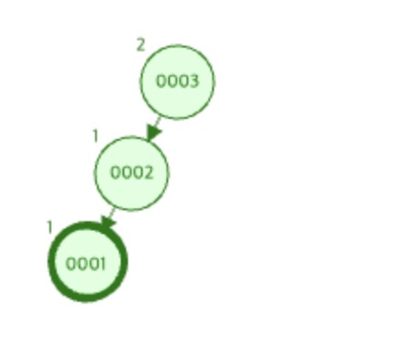
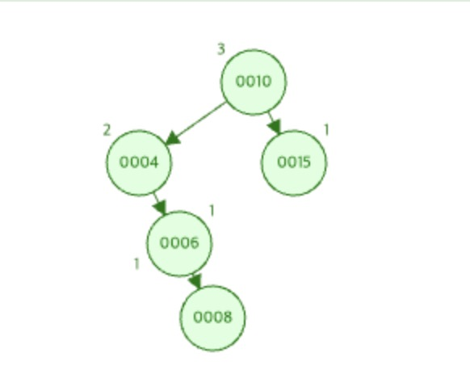
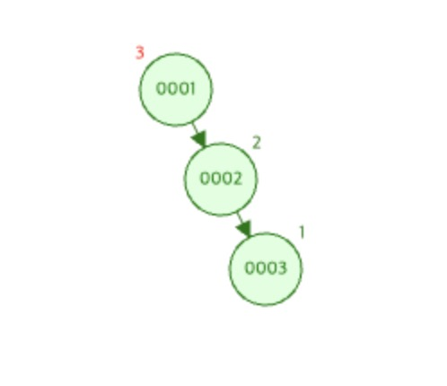
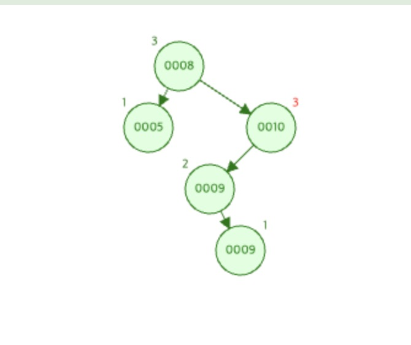

# AVL Tree (자가 균형 이진 탐색 트리)
## AVL Tree란?
- 이진 트리의 경우 균형이 맞지 않을 경우 O(n)의 검색 성능을 제공할 수 있다는 점을 보완하기 위해 탄생한 자료 구조
- 스스로 균형을 잡는 데이터 구조로 임의의 노드 x에 대하여 기준 좌측, 우측 서브 트리의 높이 차가 1보다 커지면 스스로 균형을 잡는다.
- 지속적으로 균형이 맞춰지기에 검색, 삽입, 삭제 모두 최악의 경우에 O(logn) 시간 복잡도가 보장된다.

### 특징
- 이진 탐색 트리의 속성을 가진다.
- 임의의 노드 x에 대하여 왼쪽 오른쪽 서브 트리의 높이 차이가 최대 1이다.
- 삽입/삭제 연산 결과로 서브 트리의 높이 차이가 1보다 커지면 `회전`을 통해 높이 차이를 줄인다.
- 삽입, 검색, 삭제의 시간 복잡도가 O(logn)이다

### 회전 과정
회전의 기준이 되는 3개의 노드 x, y, z를 아래와 같이 정의한다.
- z는 root로 가는 경로 상에서 가장 처음으로 위치한 불균형 노드이다. (회전이 필요한 서브트리의 루트 노드)
- y는 z의 자식 중 높이가 가장 큰 노드 
- x는 y의 자식 노드 중 높이가 가장 큰 노드

회전 연산은 y가 z의 어느쪽 방향의 노드인지, x가 y의 어느쪽 방향의 노드인지에 따라 총 4가지로 나눌 수 있다.
#### 1. LL연산

- y를 기준으로 우회전을 적용하면 불균형을 해결할 수 있다.
- single rotation에 해당한다.
#### 2. LR연산

- y를 기준으로 좌회전을 수행한 뒤 z를 기준으로 우회전을 적용하면 불균형을 해결할 수 있다
- double rotation에 해당한다.
#### 3. RR연산

- y를 기준으로 좌회전을 적용하면 불균형을 해결할 수 있다.
- single rotation에 해당한다.
#### 4. RL연산

- y를 기준으로 우회전을 수행한 뒤 z를 기준으로 좌회전을 적용하면 불균형을 해결할 수 있다
- double rotation에 해당한다.