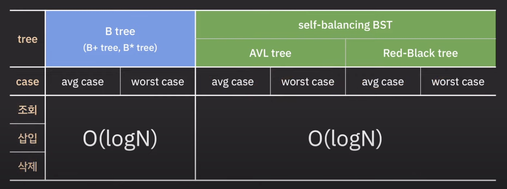
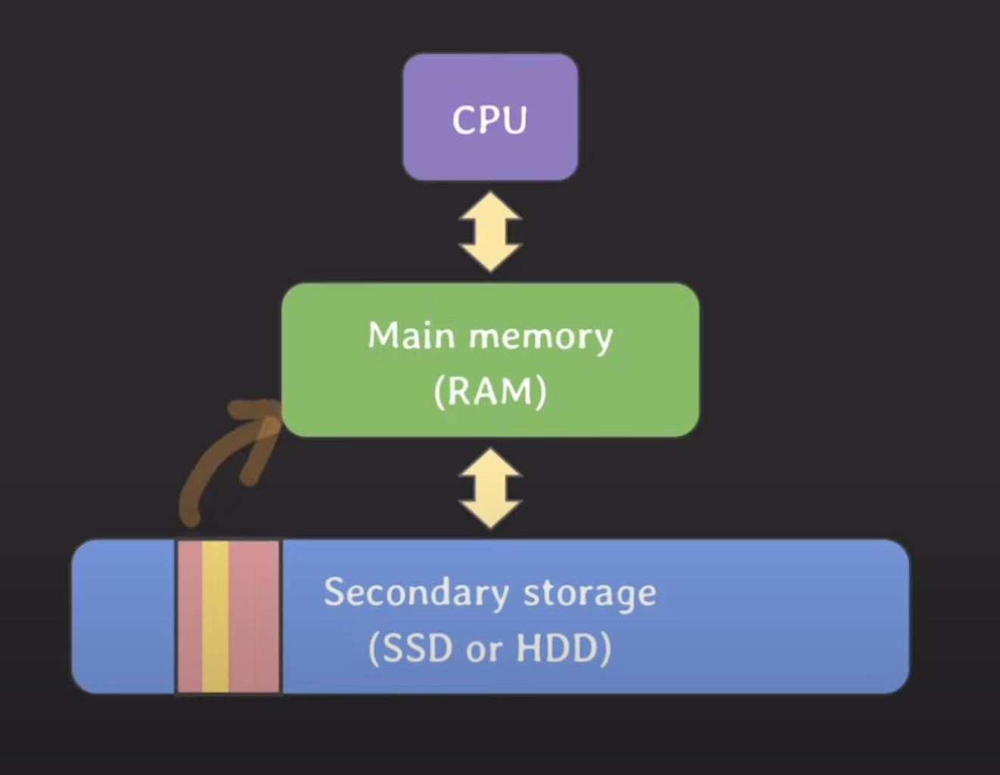

# B(alanced) Tree
## B(alanced) Tree란?
- 2진 트리를 확장한 트리
- 하나의 노드가 가질 수 있는 자식 노드의 숫자가 2보다 큰 트리이다.
- 각 노드가 가질 수 있는 최대 자녀 수를 N으로 두었을 때 N차 B Tree라 말한다.
  - 각 노드가 가져야 하는 최소 자녀 수는 Ceil(N/2)이다 (N=101일 경우 51)
- 각 노드는 최소 N/2개의 key를 가져야 하며 최대 N-1개의 key를 가질 수 있다.
- 방대한 양이 저장된 자료를 검색해야하는 경우에 자주 사용된다
- DB Index에 사용되는 자료 구조로 유명하다.

### DB Index에서는 왜 B Tree를 사용할까?

- B Tree의 시간 복잡도는 조회/삽입/삭제 모두 O(logN)이다
- 시간 복잡도로만 봤을 때 B Tree는 AVL Tree나 Red-Black Tree와 차이가 없다.
- 그렇다면 왜 DB Index에서는 B Tree 자료구조를 선택한 것일까?

- 이유를 알기 위해서는 컴퓨터에서 Secondary Storage에 접근하는 방식을 이해해야 한다.
  - DB 데이터가 기본적으로 Secondary Storage에 저장되기 때문이다.
- Secondary Storage에서 데이터를 읽을 때 필요한 데이터만 Main Memory로 가져오는 것이 아닌 block(2의 승수로 표현됨)단위로 가져온다.
  - 공간적 지역성(어떤 항목이 참조되면 그 근처의 항목들이 곧바로 참조될 가능성이 높다) 때문이다.

- Secondary Storage 접근에 대한 배경 지식을 가지고 다음 예시를 생각해보자
- Main Memory에는 루트 노드만 올라가있고 각 노드는 Secondary Storage의 다른 block에 저장되어 있다.
- 5라는 데이터를 조회한다고 가정하면 B Tree와 AVL Tree Secondary Storage에 각각 2번, 4번 접근해야 한다.
  - B Tree: [5/6/7] 노드가 포함된 Block Main Memory로 올리기 -> 5에 해당하는 Row가 있는 Block Main Memory로 올리기
  - AVL Tree: 3 노드가 포함된 Block Main Memory로 올리기 -> 4 노드가 포함된 Block Main Memory로 올리기 -> 5 노드가 포함된 Block Main Memory로 올리기 -> 5에 해당하는 Row가 있는 Block Main Memory로 올리기
- 결국 AVL Tree보다 B Tree를 사용하는 편이 Secondary Storage 접근 횟수를 줄일 수 있다.

## Reference
- [B Tree는 왜 DB Index에 사용될까?](https://youtu.be/liPSnc6Wzfk?si=oldQQg4AAbxx-R2t)