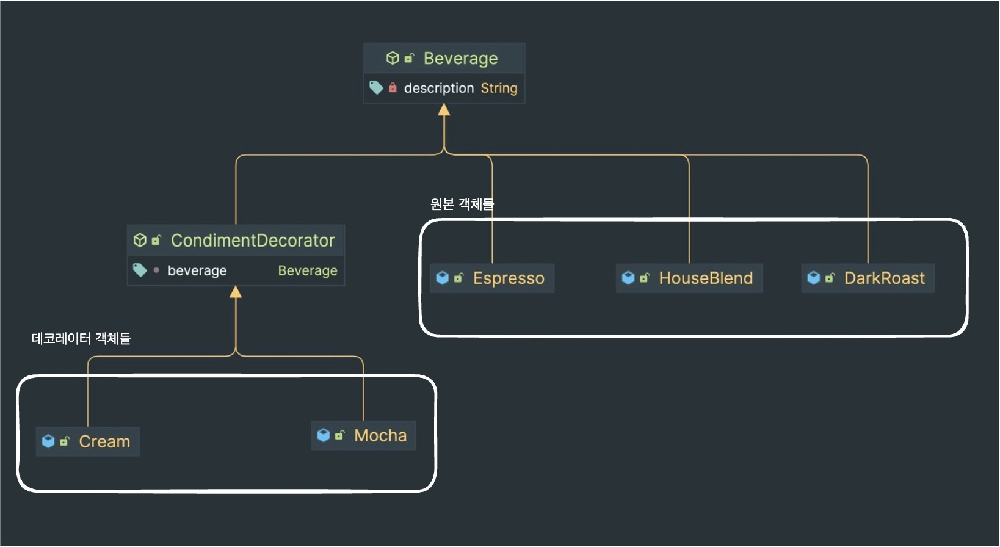

Decorator Pattern은 무엇일까?
<!-- truncate -->
<br></br>


## Decorator Pattern은 무엇인가?
---

> Decorator Pattern은 객체에 추가 요소를 동적으로 더할 수 있는 패턴을 뜻한다.  

Decorator Pattern은 원본 객체에 동적으로 추가 요소(기능)을 더할 수 있는 패턴이다. 
위 그림은 음료 가격을 계산하기 위한 로직에 Decorator 패턴을 적용한 예시이다. 
가장 상단에 Beverage라는 abstract class가 있고 이를 상속한 CondimentDecorator라는 abstractor class가 있다.
이 둘은 abstract class일 수도 있고 interface일 수도 있는데 둘은 상속 관계라는 점은 동일하다. 
Decorator abstract class(CondimentDecorator)의 특징은 부모 객체를 필드로 가지고 있다는 점인데 여기까지만 봤을 때 Proxy Pattern을 떠올릴 수 있다. 
Decorator Pattern과 Proxy Pattern은 모두 Proxy를 이용한다. 하지만 둘은 Proxy를 사용하는 의도가 다른데 Proxy Pattern이 접근을 제어를 목적으로 Proxy를 사용한다면 Decorator Pattern은 새로운 기능 추가를 목적으로 Proxy를 사용한다.   
<br></br>

이제 두 abstract class(interface)의 구현체들을 살펴보자. 
기본 구성 요소인 Beverage를 구현한 원본 객체들과 Decorator 구성 요소인 CondimentDecorator를 구현한 데코레이터 객체들이 존재한다. 
Decorator 구현체들은 필드로 원본 객체를 가지는데 이때 원본 객체는 Decorator에 감싸진 객체일 수도 있다. 하지만 Decorator 객체의 입장에서 필드로 가진 원본 객체가 Decorator에 감싸졌는지는 알 수도 없고 알 필요도 없다. 
단지 전달 받은 결과에 무언가를 추가할 뿐이다.
<br></br>

### 코드로 알아보는 Decorator Pattern
```java
public abstract class Beverage {
    private String description;

    // for Decorator
    protected Beverage() {}

    // for Client
    public Beverage(String description) {
        this.description = description;
    }

    public String getDescription() {
        return description;
    }

    abstract double cost();
}
```
우선 원본 객체의 Abstract Class(Inteface)가 필요하다. 음료 가격을 계산하려 했으니 예시에서 원본 객체들은 음료이다. Beverage 구현체 즉, 원본 객체들은 직접 쓰일 수도 있지만 Decorator에 감싸져 쓰일 수도 있다.
<br></br>

```java
public abstract class CondimentDecorator extends Beverage {
    Beverage beverage;

    protected CondimentDecorator() {}

    public CondimentDecorator(Beverage beverage) {
        this.beverage = beverage;
    }
}
```
다음은 Decorator 구성 요소를 위한 Abstract Class(Interface)이다. 이전에도 말했지만 이 코드의 특징은 (1) 원본 Abstract Class(Interface)를 상속하며 (2) 원본 객체를 필드로 가지고 있다는 점이다.
<br></br>

```java
public class Espresso extends Beverage {

    public Espresso() {
        super("에스프레소");
    }

    @Override
    double cost() {
        return 1.99;
    }
}
```
다음은 원본 구현체 중 하나인 Espresso 클래스이다. Espresso는 Beverage를 상속하기 때문에 cost()를 구현한다. 하지만 이때 Espresso의 가격만 생각하면 된다. 추가 구성 요소에 의한 가격 추가는 고려하지 않아도 된다.

```java
public class Mocha extends CondimentDecorator {
    public Mocha(Beverage beverage) {
        this.beverage = beverage;
    }

    @Override
    public String getDescription() {
        return beverage.getDescription() + ", 모카";
    }

    @Override
    double cost() {
        return beverage.cost() + 0.20;
    }
}

```
원본 구현체에서 추가 구성 요소에 의한 가격 추가를 고려하지 않아도 되는 이유인 Mocha Decorator 구현체이다. 
cost() 메서드를 보면 필드로 가진 원본 구현체의 가격에 0.20을 더해 메서드를 반환한다. (getDescription()도 마찬가지 방식으로 동작한다.)
<br></br>

```java
public static void main(String[] args) {
    Beverage espressoWithMocha = new Mocha(new Espresso());
    System.out.println(espressoWithMocha.getDescription());
    System.out.println(espressoWithMocha.cost());
}

// 에스프레소, 모카
// 2.19
```
이렇게 구성된 코드를 실행해보면 원본 구현체에 Decorator 구현체의 로직들이 잘 더해진 걸확인할 수 있다.

### Decorator 패턴으로 알아보는 디자인 원칙
> (1) 변하는 부분과 변하지 않는 부분을 분리한다. (캡슐화)
> (2) 구현보다는 인터페이스에 맞춰서 프로그래밍한다.
> (3) 상속보다는 구성(Composition)을 활용한다.
> (4) 상호작용하는 객체 사이에서는 가능한 느슨한 결합을 사용해야 한다.
> (5) 클래스는 확장에 열려 있어야 하지만 변경에 닫혀 있어야 한다. (OCP)

3가지 디자인 패턴을 공부하며 적립한 디자인 원칙이다. 까먹기 전에 디자인 원칙들을 다시 한번 되새기자. Decorator Pattern에는 4가지 디자인 원칙이 어떻게 적용되었을까?
<br></br>

우선 가격을 계산하는 로직에서 변하는 부분이 Beverage일 것이다. 주문에 따라 음료는 계속 변하고 이에 따라 가격이 변하니 이를 Beverage를 따로 분리했다고 생각할 수 있다. 
또한 모든 음료들은 Beverage Abstract Class(Interface)를 구현하고 있으니 음료 구현체를 사용하는 쪽에서는 Beverage 인터페이스에 맞게 구현이 가능하다. 
(3), (4)는 Decorator Abstract Class(Interface)에 적용되었다. 
Decorator Abstract Class(Interface)에는 Beverage가 필드로 존재하며 각 구현체가 아닌 Abstract Class(Interface)를 의존해 느슨한 관계를 유지하였다. 
덕분에 모든 Decorator는 모든 Beverage에 적용될 수 있고, 원본 객체들은 Beverage의 요건들만 만족하면 되기 때문에 변경과 확장에 용이해진다. 마지막으로 OCP원칙은 main 메서드를 보면 알 수 있다. 원본 구현체(Espresso)와 Decorator를 조합하여 인스턴스를 만들면 타입은 Beverage이다. 
즉, 사용처에서는 Decorator가 어떻게 바뀌든 원본 구현체가 어떻게 바뀌든 Beverage를 이용하기 때문에 코드가 변경되지 않는다. 하지만 Beverage의 요건에 맞는 원본 구현체와 Decorator 구현체들은 얼마든지 추가되어 확장이 가능해진다.


## 정리
Spring Framework의 적용 예시를 찾아보면 전부 Proxy 예시로 설명이 나온다. 하지만 logging을 목적으로 Proxy 객체를 두는 건 그 목적이 Decorator가 아닌가? 그래도 Proxy라는 용어로 설명되는 기능이다 보니 Proxy에
서 정리하는 편이 좋을 것 같아 예시는 생략하려 한다. 패턴을 3개 정도 공부하니 이전부터 쌓아가던 디자인 원칙들이 가물가물해진다 싶어 Decorator Pattern을 기준으로 다시 돌이켜봐서 좋았다. 하지만 이 원칙들은 만능 열쇠가 아니다. 
어쩌면 프로그램 코드를 더 복작하게 만들 수도 있고, 코드 양을 더 늘릴 수도 있다. 복잡하지 않은 곳에 무조건 디자인 패턴을 적용한다면 그 또한 잘못된 디자인일 것이다. 이 점을 유의하면서 디자인 패턴을 계속 공부해봐야겠다.
