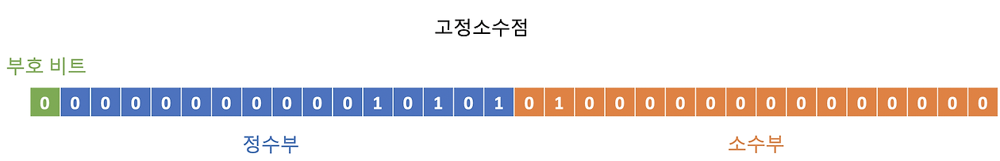
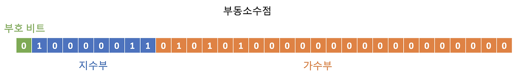

**:white_check_mark: ChatGPT 요약**
이 글은 Java에서 실수를 표현하는 방법에 대해 설명합니다. 주로 사용되는 float, double, 그리고 BigDecimal의 특징과 차이점, 그리고 올바른 사용법을 다룹니다. 또한, 부동 소수점 연산의 한계와 그로 인한 오차, 이를 극복하기 위한 BigDecimal의 사용법 및 주의사항을 자세히 설명합니다.
<!-- truncate -->
<br></br>


## 컴퓨터의 실수 표현
---
Java에서 실수 연산을 하면 종종 오차가 발생할 때가 있다. 실수 연산의 오류로 가장 많이 언급되는 예시는 아마 0.1 + 0.2 =! 0.3일 것이다. 
연산에 있어서는 누구보다 정확할 것 같던 컴퓨터도 실수 연산에서 오차가 생기는데 돈이 오가는 프로그램에서 이런 오차를 어떻게 극복할지 궁금해졌다.
<br></br>

### 고정 소수점과 부동 소수점  
0과 1만 이해하는 컴퓨터가 실수를 표현하는 방식에는 크게 2가지가 존재한다. 바로 고정 소수점과 부동 소수점이다.
<br></br>

#### 고정 소수점

고정 소수점은 부호를 나타내는 sign, 정수를 나타내는 integer part, 소수를 나타내는 fractional part 3개의 공간을 활용해 실수를 표현한다.
고정 소수점을 활용해 32비트로 실수를 표현한다 가정할 때 1비트를 sign, 15비트를 integer part, 16비트를 fractional part에 할애한다.
이 방식은 정수부와 소수부의 경계가 명확하여 계산 방식이 간단하다는 장점이 존재한다. 이 방식에는 2가지 문제점이 존재한다.
<br></br>

**(1) 정확한 소수 표현이 불가능하다.**  
이 문제점은 고정 소수점의 문제라기 보다는 소수를 2진수로 표현하는 과정에서 발생하는 문제이다. 2진수로 0.3을 표시하려면 0.010011001100110011...과 같은 형태로 0011이 반복된다. 0011을 무한히 반복해도 0.3과 근사해질 뿐 절대 0.3이 되지는 못한다. 게다가 무한히 0011을 반복한다는 건 저장공간을 무한히 사용한다는 말이라는 점도 간과하면 안 된다. 즉, 아무리 큰 저장 공간을 사용해도 정밀한 근사값 밖에는 얻을 수 없다.   
<br></br>

**(2) 큰 수를 표현하기에 부적합하다.**   
고정 소수점은 integer part 15비트와 fractional part 16비트를 구분하여 사용한다. 이는 정수와 소수를 구분하는 간단한 기준을 제공하지만 정수를 15 비트 내에서 표현해야 한다는 제약 조건을 만든다. 즉, 15비트로 표현 가능한 수가 고정 소수점이 표현할 수 있는 범위가 된다.
<br></br>

#### 부동 소수점

부동 소수점은 고정 소수점의 2번 문제(큰 수를 표현하기에 부적합하다.)를 해결할 수 있는 방법이다. 
부동은 떠다닌다는 의미를 가진 단어인데 소수점의 위치가 움직인다는 의미로 해석할 수 있다. 
단어의 의미가 말해주듯이 부동 소수점은 부호를 나타내는 sign, 숫자를 나타내는 mantissa(가수부), 소수점 위치를 나태내는 exponent(지수부)로 나뉜다. 
(실제 지수부는 지수 + bias값이다) 부동 소수점을 활용해 32비트로 실수를 표현한다면 1비트를 sign에, 8비트를 exponent(지수부)에, 23비트를 mantissa(가수부)에 할애한다. 
이 말은 즉 23비트로 표현 가능한 수가 부동 소수점이 표현할 수 있는 범위가 되기 때문에 고정 소수점에 비해 큰 수를 표현할 수 있다는 장점이 있다. 
하지만 부동 소수점 또한 1번 문제(정확한 소수 표현이 불가능하다.)는 해결하지 못한다.
<br></br>


##  Java의 실수 표현
---
float과 double은 실수를 표현하기 위한 java의 primitive type이다.
두 타입 모두 IEEE 754 표준에 따른 부동 소수점을 사용하지만 차이점이 있다면 float은 32비트, double은 64비트 저장 공간을 사용한다.
때문에 double이 float에 비해 더 큰 수를 표현할 수 있다.
<br></br>

부동 소수점에서 큰 수를 표현할 수 있다는 건 더 세밀한 숫자를 표현할 수 있다는 의미이다.
float의 경우 7자리, double의 경우 15 ~ 16자리까지 표현이 가능한데 이 값은 소수점 자리수를 의미하기도 하기 떄문이다.
<br></br>

```java
float floatVal = 0.12345678901234512f;
double doubleVal = 0.12345678901234512;

System.out.println(“float value: " + floatVal);
System.out.println(“double value: " + doubleVal);

// float value: 0.12345679
// double value: 0.12345678901234512
```
위 예시를 보면 float은 소수점 8번째 자리에서 반올림이 되어 근사값이 표시되었지만 double은 소수점 17번째 자리까지 명확하게 명시된 것을 확인할 수 있다.
<br></br>

```java
float floatVal = 0.1f + 0.2f;
double doubleVal = 0.1 + 0.2;

System.out.println("float value: " + floatVal);
System.out.println("double value: " + doubleVal);

// float value: 0.3
// double value: 0.30000000000000004
```
float과 double의 차이점과 컴퓨터가 실수를 명확히 표현할 수 없다는 점에서 의도치 않은 상황이 생기기도 한다. 컴퓨터의 실수 표현 예시에서 컴퓨터가 0.3을 명확히 표시할 수 없다는 사실을 알아봤다. 하지만 float을 사용하면 0.1 + 0.2가 0.3이 된다. 이는 float이 표현할 수 있는 자리수가 double에 비해 적어 근사값을 처리하는 바람에 얼떨결에 더 정확한 숫자가 된 것이다.
<br></br>

2가지 예시에서도 확인할 수 있었지만 float과 double은 부동 소수점을 활용하여 실수를 표한하기 때문에 컴퓨터의 실수 표현이 가진 고질적인 문제를 가지고 있다. 그렇다면 작은 오차도 없어야 하는 곳에서는 어떤 타입을 사용해야 할까?


### BigDecimal
BigDecimal은 클래스는 임의 정밀도의 부호가 존재하는 실수 표현이 가능한 클래스이다. 임의 정밀도는 쉽게 말해 자릿수의 제한이 없다는 뜻인데 그만큼 정밀한 숫자를 표현할 수 있다는 뜻이다.  또 다른 특징은 BigDecimal은 10진수를 사용한다는 점이다. 인스턴스 내부에 가수부와 지수부에 관련된 필드를 여럿 가지고 있다.
<br></br>

```java
public class BigDecimal extends Number implements Comparable<BigDecimal> {
	private final BigInteger intVal;
	private final int scale;
	private transient int precision;
	private final transient long intCompact;
}
```
BigDecimal 내부에는 여러 필드들이 존재하지만 핵심은 4개인 것 같다.
- intVal: BigDecimal의 정수 값 부분을 나타내며, 소수점의 영향을 받지 않는 값
- scale: 소수점의 위치를 나타내는 값으로, 숫자 전체에서 소수점 오른쪽에 있는 자릿수의 개수를 나타내는 값
- precision: 유효한 자릿수를 뜻하는 값
- intCompact: BigDecimal이 long.MAX_VALUE보다 작을 경우 사용되는 값
<br></br>

BigDecimal은 float과 double에 비해 정교한 계산을 가능하긴 하지만 이에 대한 trade off로 성능이 떨어지고 메모리를 더 많이 차지한다는 단점이 있다. 
때문에 trade off를 잘 고려하여 적절한 데이터 타입을 사용하는 것이 중요하다. 뿐만 아니라 BigDecimal을 사용할 때는 주의할 점이 몇가지 있는데 주의 점을 마지막으로 글을 마무리하려 한다.


#### (1) static factory method 또는 String을 사용해 BigDecimal을 생성하자
```java
BigDecimal withStaticFactoryMethod = BigDecimal.valueOf(0.1);
BigDecimal withString = new BigDecimal("0.1");
BigDecimal withConstructor = new BigDecimal(0.1);

System.out.println(withStaticFactoryMethod); // 0.1
System.out.println(withString); // 0.1
System.out.println(withConstructor); // 0.1000000000000000055511151231257827021181583404541015625


// Bigdecimal Static Factory Method
public static BigDecimal valueOf(double val) {
    return new BigDecimal(Double.toString(val));
}
```
근사값을 담고 있는 double을 이용해 BigDecimal의 생성자를 실행할 경우 오차가 그대로 반영된다. 때문에 BigDecimal을 생성할 때는 static factory method 또는 문자열을 활용해 생성자를 이용하자.
참고로 static factory method인 valueOf() 또한 문자열과 생성자 조합으로 BigDecimal 인스턴스를 생성한다.


#### (2) 소수점 처리 전략을 꼭 설정하자
```java
// Exception in thread "main" java.lang.ArithmeticException: Non-terminating decimal expansion; no exact representable decimal result.
// at java.base/java.math.BigDecimal.divide(BigDecimal.java:1766)
// at version.Java9.main(Java9.java:8)
BigDecimal unlimitied = BigDecimal.valueOf(10).divide(BigDecimal.valueOf(3));


// 3.33
BigDecimal halfUp = BigDecimal.valueOf(10).divide(BigDecimal.valueOf(3), 2, RoundingMode.HALF_UP);
```
소수점 전략을 명확히 수립하지 않으면 무한한 수가 나올 수 있는 상황에서 ArithmeticException이 발생한다. 때문에 소수점 처리 전략을 꼭 확인하자.


#### (3) 동등성 비교 시 compareTo()와 equals()의 동작 방식이 다르다는 것을 인지하자
```java
BigDecimal x = new BigDecimal("2.0");
BigDecimal y = new BigDecimal("2.00");

System.out.println("Equals: " + x.equals(y));      // Equals: false
System.out.println("CompareTo: " + x.compareTo(y));  // CompareTo: 0
```
BigDecimal의 equals()는 scale도 비교하는 반면 compareTo()의 경우 크기만 비교한다. 두 메서드의 비교 방식이 다르다는 것을 이해하고 필요에 따라 적절한 메서드를 사용하자.