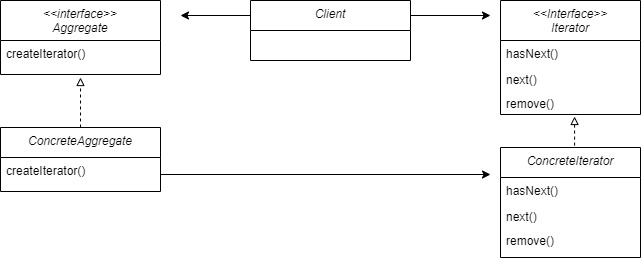
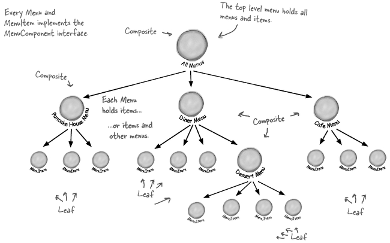
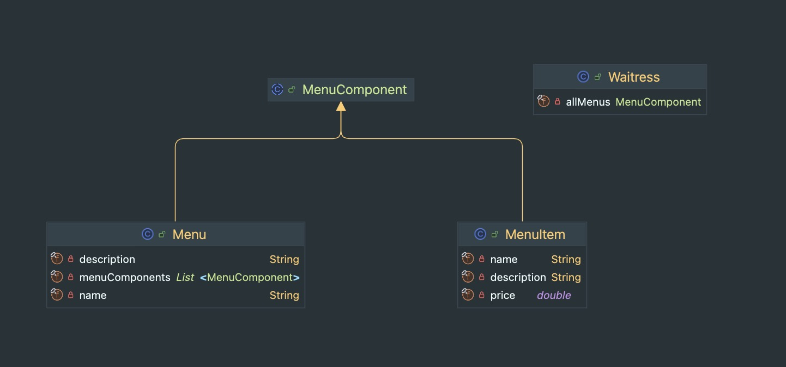

**:white_check_mark: ChatGPT 요약**
이 글은 Iterator 패턴과 Composite 패턴에 대해 소개합니다. Iterator 패턴은 컬렉션의 내부 구조를 노출하지 않고 모든 항목에 접근하는 방법을 제공하는 디자인 패턴입니다. Composite 패턴은 개별 객체와 복합 객체를 동일하게 다룰 수 있도록 하는 패턴으로, 복잡한 계층 구조를 단순하게 처리할 수 있게 해줍니다. 이 글에서는 각각의 패턴에 대한 개념과 Java에서의 구현 예제를 통해 두 패턴의 장점과 활용 방법을 설명합니다.
<!-- truncate -->
<br></br>


## Iterator Pattern은 무엇인가?
> Iterator 패턴은 컬렉션의 구현 방법을 노출하지 않으면서 집합체 내의 모든 항목에 접근하는 방법을 제공한다.

여러 개의 값 혹은 객체를 보관하는 방법은 다양하다. 배열을 활용할 수도 있고 Java Collection Framework에서 제공하는 다양한 자료구조를 이용할 수도 있다. 
보관 방법이 다양하면 값 혹은 객체에 접근하는 방식 또 다양해야 할까? 이러한 물음에 해답을 제시하는 패턴이 Iterator 패턴이다.
<br></br>

### Iterator Interface
```java
public interface Iterator<E> {
    boolean hasNext();

    E next();

    default void remove() {
        throw new UnsupportedOperationException("remove");
    }

    default void forEachRemaining(Consumer<? super E> action) {
        Objects.requireNonNull(action);
        while (hasNext())
            action.accept(next());
    }
}
```
Iterator Interface는 java.util 패키지에 존재하는 Interface이다. Java Collection Framework에서 제공하는 자료 구조가 가진 요소들에 순차적으로 접근하고 조작하는 일관된 방식을 제공한다.
Collection Framework에서 제공하는 모든 자료 구조를 확인해보면 보유한 요소들을 Iterator로 반환하는 메서드를 가지는 것을 확인할 수 있다.
<br></br>
Iterator에는 총 4개의 메서드가 존재한다. 다음 요소의 존재를 반환하는 hasNext(), 다음 요소를 반환하는 next(), 마지막에 반환된 요소를 Collection에서 제거하는 remove(), 마지막으로 남겨진 요소들에 특정 로직을 적용할 수 있는 forEachRemaining(Consumer\<? super E> action)까지 4개이다.
<br></br>



Iterator Pattern은 Iterator Interface를 적극 활용한다. Client는 Aggregate Interface와 Iterator Interface 타입만 사용한다.
Aggregate Interface의 createIterator() 메서드를 통해 Iterator를 얻어 각 요소를 순회할 수 있다. 이렇게 되면 Client는 ConcreteAggregate가 여러 개의 값 혹은 객체를 어떤 방식으로 저장하고 있는지 알 필요가 없어진다. 
즉, 내부 구현 방법 (데이터 저장 방식)을 외부로 노출하지 않으면서 모든 요소를 순회할 수 있게 된다.
<br></br>

### 단일 책임 원칙 (SRP)
Iterator Pattern은 단일 책임 원칙을 만족한다. 만약 ConcreteAggregate 클래스에서 내부 데이터를 다루는 작업과 반복자용 메서드 관련 기능을 전부 구현한다면 어떨까? ConcreteAggregate가 변경되는 요인이 2가지가 되는 것이다. 하지만 반복자용 메서드 기능을 ConcreteIterator로 돌리며 각 클래스는 하나의 역할을 가짐과 동시에 변경 요인이 하나가 된다.


## Composite Pattern은 무엇인가?


Composite Pattern에 대해 얘기하기 위해서는 우선 예시를 드는 게 좋을 것 같다. 위 그림과 같이 모든 Menu를 Tree 구조로 나타내야 한다고 가정하자. 
이때 노드는 단일 음식을 나타낼 수도 있고 여러 음식을 포함한 또 하나의 작은 메뉴 리스트를 나타낼 수 있다.
<br></br>

예시에서 노드는 2가지 케이스로 나뉜다. 만약 2가지 케이스의 구현체가 다르다면 Tree를 순회하기 위해서는 매번 현재 노드가 2가지 케이스 중 어떤 노드인지를 확인해야 한다. 하지만 Composite Pattern을 사용하면 그럴 필요가 없다.
<br></br>


> Composite Pattern은 클라이언트가 개별 객체와 복합 객체를 똑같은 방법으로 다룰 수 있는 방법을 제공하는 패턴이다.

정의와 같이 Composite Pattern을 활용하면 예시의 2가지 케이스를 동일한 방식으로 다룰 수 있다. 예시의 음식은 Leaf 클래스이고 음식 리스트는 Composite 클래스이다. 이 둘은 모두 Component를 상속 혹은 구현한다. 이를 통해 Client는 모든 노드를 Component 타입으로 다룰 수 있게 된다.
<br></br>

### 코드로 알아보는 Composite Pattern

이제부터 살펴볼 코드의 클래스 다이어 그램이다. 구성 자체가 워낙 간단하다.
<br></br>

```java
public abstract class MenuComponent {

    public void add(MenuComponent menuComponent) {
        throw new UnsupportedOperationException();
    }

    public void remove(MenuComponent menuComponent) {
        throw new UnsupportedOperationException();
    }

    public MenuComponent getChild(int i) {
        throw new UnsupportedOperationException();
    }

    public String getName() {
        throw new UnsupportedOperationException();
    }

    public String getDescription() {
        throw new UnsupportedOperationException();
    }

    public double getPrice() {
        throw new UnsupportedOperationException();
    }

    public void print() {
        throw new UnsupportedOperationException();
    }
}
```
우선 부모 클래스인 MenuComponent이다. MenuComponent는 Menu와 MenuItem을 위한 메서드를 모두 가지고 있어야 한다. 단, 구현체에 맞지 않는 메서드 사용을 방지하기 위해 모든 메서드에서는 UnsupportedOperationException을 throw하고 각 구현체에서 필요한 메서드를 Override하도록 구성한다.
<br></br>

```java
public class Menu extends MenuComponent {
    private final List<MenuComponent> menuComponents;
    private final String name;
    private final String description;

    public Menu(String name, String description) {
        this.menuComponents = new ArrayList<>();
        this.name = name;
        this.description = description;
    }

    public void add(MenuComponent menuComponent) {
        menuComponents.add(menuComponent);
    }

    public void remove(MenuComponent menuComponent) {
        menuComponents.remove(menuComponent);
    }

    public MenuComponent getChild(int index) {
        return menuComponents.get(index);
    }

    public String getName() {
        return name;
    }

    public String getDescription() {
        return description;
    }

    public void print() {
        System.out.println(getName() + ": " + getDescription());
        System.out.println("---------------------------------------");
        for (MenuComponent menuComponent : menuComponents) {
            menuComponent.print();
        }
    }
}

public class MenuItem extends MenuComponent {
    private final String name;
    private final String description;
    private final double price;

    public MenuItem(String name, String description, double price) {
        this.name = name;
        this.description = description;
        this.price = price;
    }

    public String getName() {
        return name;
    }

    public String getDescription() {
        return description;
    }

    public double getPrice() {
        return price;
    }

    public void print() {
        System.out.println(getName() + ": " + getDescription() + " " + getPrice());
    }
}
```
자식 클래스인 MenuItem과 Menu이다. MenuItem은 예시의 음식 리스트이고 Menu는 예시의 음식이다. 
두 클래스의 차이점을 보면 MenuItem은 음식을 추가/삭제/조회할 수 있는 add/remove/getChild 메서드가 존재한다는 점이다. 
또한 print() 메서드를 확인해보면 구현 방식이 다르다는 점을 확인할 수 있다.
<br></br>

```java
public class Waitress {
    private final MenuComponent allMenus;

    public Waitress(MenuComponent allMenus) {
        this.allMenus = allMenus;
    }

    public void printMenu() {
        allMenus.print();
    }
}
```
마지막으로 Client인 Waitress를 보면 allMenus 즉, 메뉴 Tree의 Root Node를 필드로 가진다. 또한 print() 메서드를 통해 트리의 모든 노드를 출력할 수 있는데, 구현부에서 출력할 노드가 Leaf인지 Composite인지 확인하는 코드는 없다.
<br></br>

## 정리
Iterator Pattern과 Composite Pattern에 대해 알아봤다. 다른 패턴들에 비해 간단해 이해가 어렵지는 않았다. 책에서 두 패턴을 왜 한 챕터에서 다뤘는지 이야기해주지 않지만 그 이유가 궁금해서 잠깐 생각해보면. 두 패턴 모두 여러 구현체의 일관된 사용 방식을 제공한다는 점이 동일하다. Iterator에서는 여러 Concrete Iterator를 Iterator 인터페이스를 활용해 이용할 수 있었고, Composite Pattern에서는 Leaf와 Composite를 Component 추상 클래스를 통해 이용할 수 있었다. 이런 공통점이 두 패턴을 하나의 챕터에 묶어둔 이유가 아닐까 싶다.