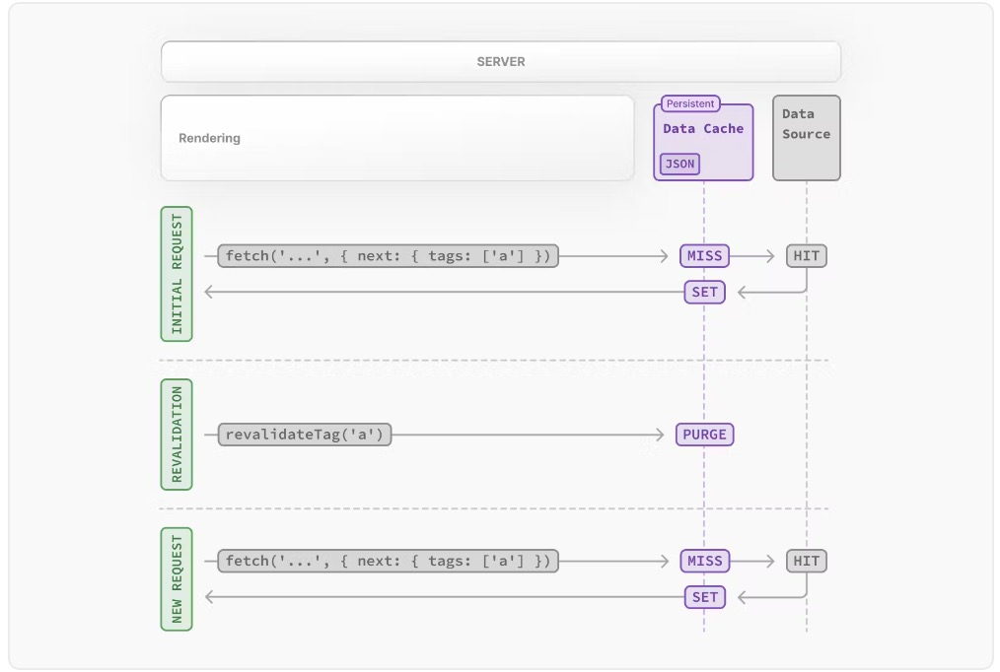

# Caching,Revalidating, Data Fetching

## Caching
- 익히 알고 있는 Caching 개념이다.
- re-fetched를 방지하기 위해 사용됨
- 자세한 내용은 [Data Cache 공식 문서](https://nextjs.org/docs/app/building-your-application/caching#data-cache)참고

### fetch
- fetch()를 사용하면 Next.js에서 자동으로 Caching을 적용한다.
    - request time 또는 build time에 Caching하여 매 요청에서 사용한다.
- POST 메서드의 fetch 또한 자동을 Cache가 적용된다.
    - 단, Route Handler 내부에서 POST fetch()를 사용하면 Cache가 적용되지 않는다.

### Caching opt-out
```typescript
// 개별 fetch에 대하여 옵션으로 캐시 무효화 가능
fetch(`https://...`, { cache: 'no-store' })

// Route Segment config로 캐시 무효화도 가능
// third-part libraries를 사용해도 캐시 무효화됨
// layout.tsx | page.tsx | route.ts 파일에서 선언 가능
export const dynamic = 'force-dynamic'
```
- [Route Segment Config](https://nextjs.org/docs/app/api-reference/file-conventions/route-segment-config) `나중에 다시 확인`

## Revalidating
- Cache Data를 지우고 데이터를 최신화하는 프로세스이다.
- 2가지 방식의 Revalidating을 지원한다.
    - **Time-based revalidation**
    - **On-demand revalidation**

### Time-based Revalidation
```
// fetch() 단위로 적용하는 방법
fetch('https://...', { next: { revalidate: 3600 } })


// route segment 단위로 설정하는 방법
export const revalidate = 3600 // revalidate at most every hour
```
- 같은 경로에 3개의 fetch 요청이 존재하고 각각 다른 revalidation time을 가지고 있다면?
    -  static rendering: 가장 낮은 시간으로 3개 fetch의 revalidation time이 동일하게 적용된다
    - dynamic rendering: 개별적으로 적용된다.
- [Time-based Revalidation](https://nextjs.org/docs/app/building-your-application/caching#time-based-revalidation)

### On-demand Revalidation

- 기본적으로 Data를 Cache하고 on-demend revalidation이 trigger되었을 때 요청에 맞는 cache data를 삭제한다.
- 이후 요청에서 Cache Miss가 나기 때문에 새로운 데이터를 Cache에 저장한다.
- Cache 삭제 기능으로 이해하면 될듯
- [On-demand Revalidation](https://nextjs.org/docs/app/building-your-application/caching#on-demand-revalidation)


## Data Fetching

- 4가지 Data Fetching 방법을 제공한다.
    1. On the server - with fetch
    2. On the sever - with third-party libraries
    3. On the client, via a Route Handler
    4. On the client, with third-party libraries
        - SWR
        - TanStackQuery 추천
### 1.  On the server - with fetch
```
async function getData() {
  const res = await fetch('https://api.example.com/...')
  // The return value is *not* serialized
  // You can return Date, Map, Set, etc.
 
  if (!res.ok) {
    // This will activate the closest `error.js` Error Boundary
    throw new Error('Failed to fetch data')
  }
 
  return res.json()
}
 
export default async function Page() {
  const data = await getData()
 
  return <main></main>
}
```
- 위와 같이 `fetch` Web API를 이용해 서버에서 caching과 revalidating을 요청별로 설정하여 사용할 수 있다.
- 아래 위치에서 async / await과 함께 `fetch`를 사용해 Data를 가져올 수 있다
    - Server Component
    - Route Handler
    - Server Action
- Server Component에서는 편리한 메서드(cookies(), headers())를 제공한다.
    - 단 사용시 Dynamic Rendering 방식이 적용된다.
- Route Handler는 React Tree의 요소가 아니기에 request가 memoized되지 않는다.


### 2.  On the sever - with third-party libraries
```
import { cache } from 'react' // 요청을 memoize하기 위해 사용됨
 
export const getItem = cache(async (id: string) => {
  const item = await db.item.findUnique({ id })
  return item
})


// app/item/[id]/layout.tsx
// layout에서 사용될 수 있다

import { getItem } from '@/utils/get-item'
 
export const revalidate = 3600 // revalidate the data at most every hour
 
export default async function Layout({
  params: { id },
}: {
  params: { id: string }
}) {
  const item = await getItem(id)
  // ...
}


// app/item/[id]/page.tsx
// 당연히 page에서 사용도 가능하다.

import { getItem } from '@/utils/get-item'
 
export const revalidate = 3600 // revalidate the data at most every hour
 
export default async function Page({
  params: { id },
}: {
  params: { id: string }
}) {
  const item = await getItem(id)
  // ...
}
```


### 3.  On the client
- Route Handler를 활용
- third party libraries(SWR, TanStack Query) 활용