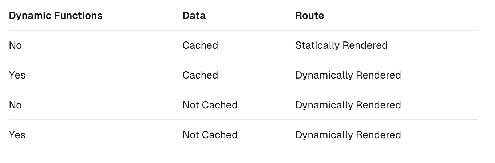

# Rendering - Server Components
- server에서 rendering되고 선택적으로 캐싱되는 UI를 제공한다.
- route segments에 따라 3가지 server rendering 전략이 존재한다.
    - Static Rendering
    - Dynamic Rendering
    - Streaming

## Server Rendering의 장점
- data fetching
- security
- caching
- bundle size
- initial page load and FCP(First Contentful Paint)
- Search Engine Optimization and Social Network Shareability
- Streaming

## 사용법
- Next.js에서는 server component가 default이다.
- 추가 설정 없이 Server Component를 이용할 수 있다.

## Server Component Rendering 방식
- Next.js는 React's APIs를 활용해 orchestrate rendering을 한다. (잘 조율해서 rendering 한다 정도로 이해)
- route segment와 Suspense Boundaries에 따라 동작은 달라질 수 있다.
- 각 Chunk 동작 순서 (client component full page load와 동작 방식이 동일하다.)
    1. server component를 RSC Payload 데이터 형식으로 렌더링한다.
    2. RSC Payload와 client component JS 명령어를 활용해 HTML을 렌더링한다.
- 이후 Client 작업 순서
    1. HTML은 즉각적인 preview를 제공한다(non-interactive)
    2. RSC Payload를 활용해 client / server Component tree를 재구성하고 DOM을 업데이트 한다.
    3. JS 명령어를 활용해 client component들을 hydrate하고 client component들을 interactive하게 만든다.

### Server Rendering 전략
### 1. Static Rendering(Default)
- `build time` 또는 data revalidation(`확인 필요`) 이후에 rendering 된다.
- 결과는 캐싱되거나 CDN에 저장될 수 있다.
- blog post나 상품 페이지 같이 개인화되지 않은 페이지에 유용하다/

### 2. Dynamic Rendering
- `request time`에 rendering 된다.
- request time에 정보를 알 수 있거나 개인화된 데이터가 필요할 때 유용하다.
    - cookie 또는 URL의 search param (body는 사용할 수 없을까....)
- 캐싱 데이터와 실시간 데이터를 조합해서 rendering을 할 수도 있다.

- Dynamic Rendering을 개발자가 선택할 필요는 없다.
- Next.js에서 Dynamic Function과 Cache 사용 여부에 따라 자동으로 최적의 Rendering 전략을 선택해준다.
- 위 표를 기준으로 Rendering 전략이 자동 선택된다.
- 개발자는 Cache를 사용할 것인지 또는 data revalidate를 할 것인지만 선택하면 된다.

#### Dynamic Function
- user's cookies, request header, URL's search params와 같이 `request time`에 알 수 있는 정보들을 사용한다.
- 3가지 중 1가지 정보라도 이용할 경우 Dynamic Rendering이 적용된다.

### 3. Streaming
- Streaming을 활용하면 UI를 점진적으로 rendering할 수 있다.
- 동작이 chunk 단위로 나뉘고 준비가 완료되면 client로 streaming된다.
- 유저가 전체 페이지 렌더링 이전에 일부를 먼저 볼 수 있게 한다.
- Next.js App Router에 기본적으로 내장되어 있음
- 동작 방식에서 예상할 수 있듯이 하나의 chunk 동작 지연이 전체 페이지 로딩을 지연시키는 병목을 맊는다.
- loading.js 또는 React Suspense를 활용한 UI Component로 Streaming을 시작할 수 있다
- 자세한 내용은 (Loading UI and Streaming)[https://nextjs.org/docs/app/building-your-application/routing/loading-ui-and-streaming]