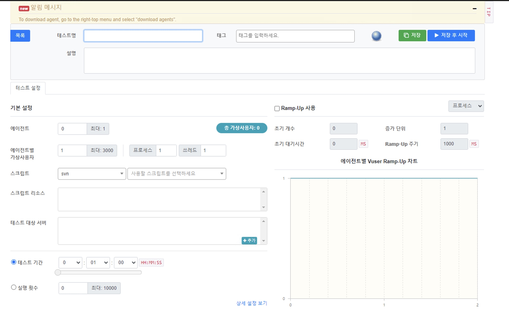

## 글 링크
- [nGrinder github wiki](https://github.com/naver/ngrinder/wiki)
## 내용 정리
### nGrinder란?
- 스크립트를 생성, 테스트 실행, 결과 생성을 동시에 할 수 있는 부하 테스트 플랫폼이다.
- naver의 오픈 소스

### 아키텍처

- Controller, Agent, Monitor로 구성되어 있다.
- Controller
  - 성능 테스트를 위한 UI를 제공한다.
  - 테스트 통계를 수집하고 시각화 및 데이터 저장을 담당한다.
  - 스크립트 작성 및 수정을 할 수 있다.
- Agent
  - 성능 대상 시스템에 부하를 가하는 프로세스 및 스레드를 실행하는 역할
  - Controller의 명령을 받아서 동작한다.
- Monitor
- 성능 테스트 대상이 되는 서버에 설치하여 테스트가 수행되는 동안 서버 상황을 Controller로 전달한다

### 테스트 생성

- [test config](https://github.com/naver/ngrinder/wiki/Test-Configuration)
- 에이전트: 사용할 Agent 수
- 에이전트별 가상 사용자: 말 그대로 사용자 수 (process * thread)
  - 모든 Agent는 multi process와 thread를 가지기 때문에 가상 사용자를 만들어낼 수 있음
- 테스트 기간: 테스트를 실행시킬 시간.
  - 이상한 점은 10명의 사용자로 20초간 2번의 테스트를 진행했을 때 요청 수가 달랐다. (4263, 5514회)
  - `원하는 시간에 원하는 양의 요청을 발생시키고 싶은데 어떻게 해야하나..`
- 실행 횟수: 테스트 기간의 대안, 사용자당 발생시킬 테스트 회수를 지정할 수 있다.
  - 테스트 수는 고정할 수 있지만 시간이 미지수이다.
- Ramp-Up: 프로세스를 점진적으로 초기화할 수 있는 기능 (매 interval마다 정해진 개수의 프로세스를 증가시킨다)

#### Virtual User 개념(가상 유저)
- [ngrinder-wiki](https://github.com/naver/ngrinder/wiki/Virtual-User)
- 사용되는 Thread 수와 같은 개념이.
- 다른 test tool과 다르게 nGrinder는 가상 유저가 실제 유저를 모방하는 것에 초점을 맞추지 않는다.
- nGrinder는 server가 한계점에 도달하도록 만드는데 집중한다.
- 유저 수를 정할 때는 Agent Server의 성능을 생각해야 함.
- NHN에서는 4GB RAM, 2 core CPU agent server에서 유저 수를 2000으로 제한한다고 한다.
- 8000정도의 유저 수는 8GB RAM, 4 core CPU가 적합하다.
- [가상 유저 수 계산기](http://www.webperformance.com/library/tutorials/CalculateNumberOfLoadtestUsers/)

### Script 작성 시 참고
- [library 사용법](https://github.com/naver/ngrinder/wiki/How-to-use-library)
- [resource 사용법](https://github.com/naver/ngrinder/wiki/How-to-use-resources)
- [read and write csv with groovy](https://groovy.apache.org/blog/reading-and-writing-csv-files)
- [groovy random 객체](https://code-maven.com/groovy-random-numbers)