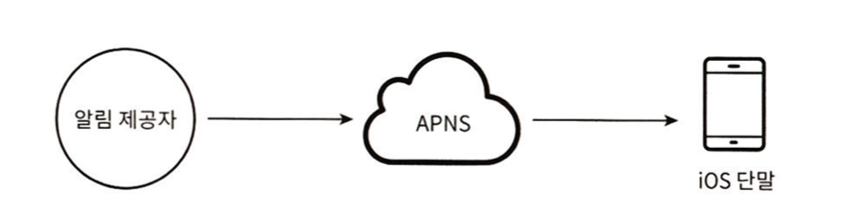
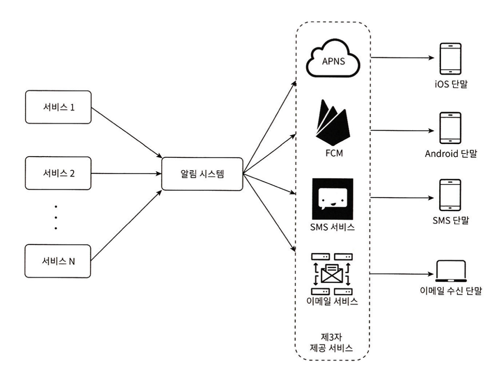
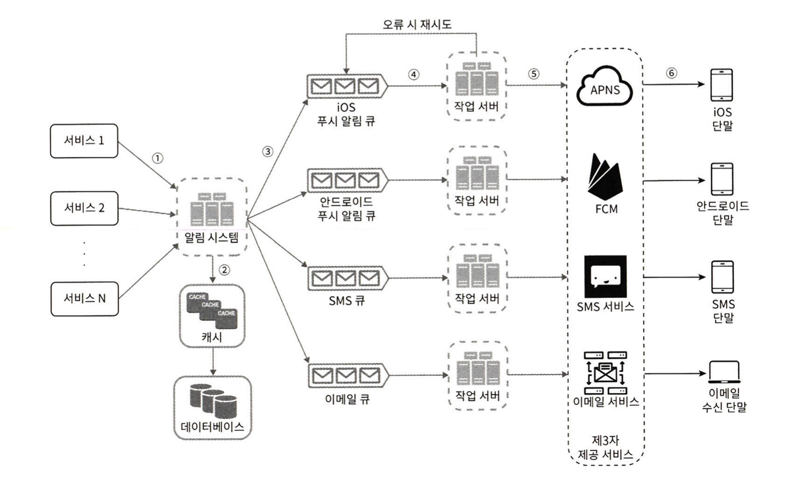
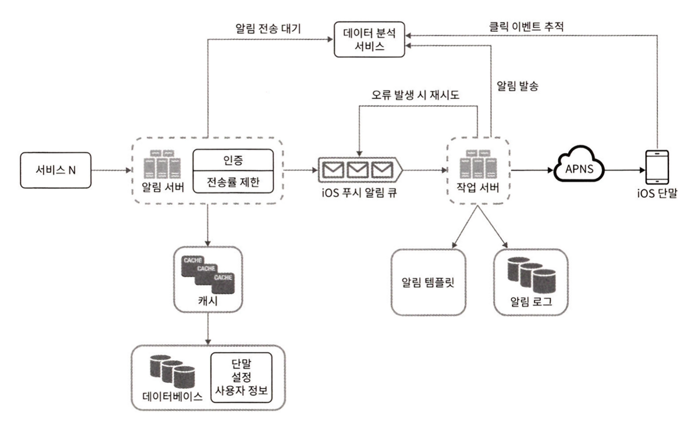

# 알림 시스템 설계
## 1. 알림 시스템이란?
- 중요 정보를 모바일 푸시 알림 / SMS / 이메일을 활용해 비동기적으로 제공하는 시스템

## 2. 설계 시 고민할 것들
- 알림 종류: 모바일 푸시 / SMS / 이메일
- 실시간 시스템 여부: 연성 / 강성 등
- 지원 단말: IOS / AND / PC 등
- 알림을 만드는 주체: 클라이언트 APP / 서버 등
- 알림 차단 가능 여부
- 예상 알림 건 수

## 3. 개략적인 설계도
### (1) 알림 유형별 지원 방안

- 위 사진은 IOS 푸시 알림을 위해 필요한 3가지 컴포넌트이다.
- 알림 제공: 알림 요청을 만들어 APNS로 보내는 역할을 담당한다.
  - 단말 토큰, 알림 내용(payload) 등의 데이터가 필요하다.
- APNS: IOS 장치로 푸시 알림을 보내는 역할을 담당하는 애플 제공 원격 서비스
- IOS 단말: 푸시 알림을 수신하는 사용자 단말
- AND, SMS, 이메일은 중간 컴포넌트만 다르지만 각 컴포넌트의 역할을 동일하다고 생각하면 된다.
  - AND: FCM
  - SMS: 트윌리오, 넥스모 등
  - 이메일: 센드그리드, 메일침프 등

### (2) 연락처 정보 수집 절차
- 알림을 보내기 위해서는 단말 토큰, 전화 번호, 이메일 주소 등의 정보가 필요하다.
- 때문에 계정을 등록할 때 사용자가 알림을 받을 수 있는 정보 또한 저장해둘 필요가 있다.
- 책에서는 휴대폰 번호, 이메일은 user 테이블에 / 단말 토큰은 테이블을 따로 구성할 것을 권장한다. (여러 단말을 가질 수 있음을 고려)

### (3) 알림 전송 및 수신 절차
#### 단일 서버 가정

- N개의 서비스는 알림 서비스를 이용하고자 하는 모든 서비스를 말한다. (배송 알림, 납기일 알림 등등)
- 알림 시스템은 N개의 서비스에 API를 제공해야 하고, 제 3자 서비스에 전달할 알림 내용(payload)를 만드는 역할을 한다.
- 제 3자 서비스는 실제 사용자에게 알림을 전달한다.
  - 이때 쉽게 새로운 서비스를 통합하거나 기존 서비스를 제고할 수 있어야 한다.
  - 또한 지역에 따라 사용 가능한 서비스를 고려해야 한다.
- 단일 서버의 문제점
  - (SPOF)알림 시스템에 장애가 발생하면 모든 알림 서비스 전체 장애로 이어진다.
  - 중요 컴포넌트의 규모를 개별적으로 늘릴 방법이 없다 (캐시, DB 등)
  - 모든 요청이 한 서버로 몰리기 때문에 트래픽이 몰리는 시간에 과부하가 발생할 수 있다.

#### 개선된 구조

- 개선된 내용
  - DB, 캐시를 알림 시스템의 서버에서 분리하였다. -> 알림 서버의 수평적 규모 확장이 가능해짐
  - 메시지 큐를 이용해 시스템 컴포넌트 간의 강한 결합을 끊었다. -> 제 3자 서비스의 추가 삭제가 용이해짐
  - SPOF가 제거되었다.
  - 하나 이상의 메시지 큐와 작업 서버를 사용한다. -> 알림을 병력적으로 처리할 수 있어졌다
- 역할의 변경
  - 알림 서버: 알림 검증, DB/캐시 조회, 알림 전송(메시지 큐에 insert)의 역할을 담당
  - 작업 서버: 메시지 큐에서 전송할 알림을 꺼내 제 3자 서비스로 전달하는 역할

## 4. 상세 설계
### (1) 안정성
- 분산 환경에서 안정성을 확보하기 위해서는 몇 가지 고려해야 하는 포인트가 있다.
- 어떠한 상황에서도 알림이 소실되지 않도록 `재시도 로직` 혹은 `로그 저장`이 필요할 수 있다.
- 알림이 중복 전송되지 않도록 구성하는 것도 중요하다.
  - 예시: 알림 전송 후 이벤트 ID를 저장해두고, 요청이 들어올 때마다 처리한 이벤트 ID인지 확인하는 로직을 추가한다.

### (2) 추가로 필요한 컴포넌트 및 고려사항
#### 알림 템플릿
- 수백만 건의 알림은 대부분 비슷한 형태일 가능성이 높다.
- 때문에 템플릿을 두고 필요한 부분만 값을 교체하며 사용한다면 형식을 일관성 있게 유지할 수 있고, 알림 작성 시간도 줄일 수 있다.

#### 알림 설정
- 사용자가 알림을 받을 것인지를 보다 상세히 설정할 수 있어야 알림에 지치는 일을 줄일 수 있다.
- 이를 위해서는 별도의 알림 설정 테이블이 필요하며, user_id/channel(알림 채널)/opt_in(알림 수신 여부) 등의 데이터가 필요할 것이다.
- 알림을 전송하는 시점에 해당 테이블을 조회하여 전송 여부를 결정하는 로직을 추가하면 된다.

#### 전송률 제한
- 사용자가 너무 많은 알림을 받아 알림 기능을 끄지 않도록, 한 사용자가 특정 시간 내에 받을 수 있는 알림을 제한하는 것도 좋은 방법이다.

#### 재시도 방법
- 알림 전송에 실패하면 재시도 전용 큐에 데이터를 넣고, 이 과정에 반복될 때는 개발자에게 알림이 가도록 구성해두는 것을 고려할 수 있다.

#### 푸시 알림과 보안
- IOS와 AND의 경우 인증된 클라이언트만 해당 API를 사용할 수 있기 때문에 알림 시스템을 구축할 때 보안에 대해 알아볼 필요가 있다.

#### 큐 모니터링
- 알림 시스템의 주요 모니터링 메트릭 중 하나는 큐에 쌓인 알림의 개수이다.
- 이 지표를 근거로 작업 서버의 개수를 조정하는 것이 바람직하다.

#### 이벤트 추적
- 알림 확인율, 클릭율, 실제 앱 사용으로 이어지는 비율과 같은 메트릭은 사용자 이해에 큰 도움을 준다.
- 이러한 작업을 위해 알림 시스템을 만들 때 데이터 분석 서비스와의 통합도 고려해야 한다.

### (3) 수정된 설계안

- 수정된 내용
  - 알림 서버에는 인증 / 전송률 제한 기능이 추가되었다.
  - 작업 서버에는 재시도 기능이 추가되었고, 실패 로그를 남길 저장소도 마련되었다.
  - 전송 템플릿을 사용해 알림 생성을 단순화하였다.
  - 모니터링과 추적 시스템을 추가하여 시스템 상태를 확인하고 추후 시스템 개선에 활용할 수 있도록 구축하였다.
