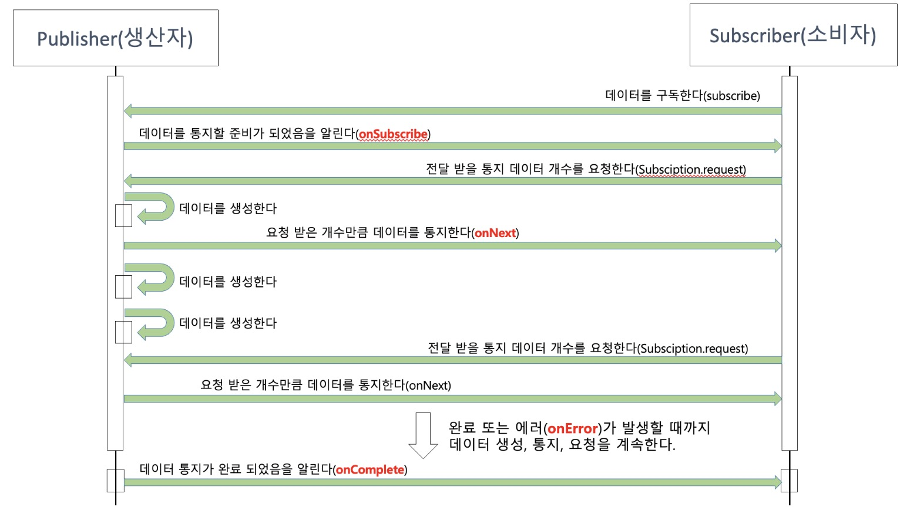

# 리액티브 프로그래밍
## 1. 리액티브 시스템이란?
- Reactive라는 단어에서도 알 수 있듯이 반응을 잘 하는 시스템을 뜻한다.
- 반응을 잘 한다는 것은 `클라이언트의 요청에 즉각적으로 응답함으로써 지연 시간을 최소화하는 것`
- 핵심 가치 3가지
    - MEANS: 비동기 메시지 기반의 통신을 통해 구성 요소 간 느슨한 결합, 격리성, 위치 보장성이 보장되어야 함
    - FORM: 탄력성과 회복성을 가지는 시스템
        - 탄력성 - 시스템의 작업량이 변화해도 일정한 응답을 유지
        - 회복성 - 시스템에 장애가 발생하더라도 장애 발생 지점 이외의 시스템은 여전히 응답 가능하고, 발생 지점만 복구하면 된다는 의미
    - VALUE: 시스템의 처리량을 자동으로 확장/축소하는 탄력성을 확보함으로써 즉각적으로 응답 가능한 시스템을 구축할 수 있음을 의미
- 빠른 응답성을 바탕으로 확장이 용이한 시스템을 구축하는데 활용 가능

## 2. 리액티브 프로그래밍이란?
- 리액티브 시스템을 구축하는데 필요한 프로그래밍 모델
- Non-Bloccking I/O 방식의 통신을 사용
- 특징 2가지
    - 선언형 프로그래밍
        - Java Stream pipeline을 생각하면 쉽다
        - 동작을 구체적으로 명시하지 않고 목표만 선언한다
        - 여러 동작이 메서드 체인을 활용해 한 문장으로 표현됨
        - 메서드 체인은 데이터 흐름을 한 눈에 파악 가능해 가독성이 좋고 코드가 간결해진다 (어떻게 짜느냐에 따라 다를듯..)
        - 함수형 프로그래밍으로 구성된다
            - filter(number -> number > 6 && (number % 2 != 0))
    - data streams와 propagation of change
        - data streams - 데이터가 지속적으로 발생한다는 특징
        - propagation of change - 지속적으로 데이터가 발생할 때마다 이벤트를 발생시키면서 데이터를 계속 전달한다는 특징

## 3. 리액티브 프로그래밍 코드 구성
### Publisher
- 입력으로 들어오는 데이터를 제공하는 역할
### Subscriber
- Publisher가 제공한 데이터를 전달 받아서 사용하는 주체
### Data Source / Data Stream
- Data Source: 최초로 생성되는 데이터 그 자체
- Data Stream: Publisher의 입력으로 들어오는 데이터 형태
- 둘은 같다고 봐도 무방하다
### Operator
- Publisher와 Subscriber 사이에서 적절한 가공처리를 담당하는 주체


## 2. 리액티브 스트림즈
- 리액티브 라이브러리를 어떻게 구현할지 정의한 표준 사양을 뜻한다.
- 정확히는 데이터 스트림을 Non-Blocking이면서 비동기적인 방식으로 처리하기 위한 리액티브 라이브러리 표준 사양
### 리액티브 스트림즈 구성 요소와 동작 방식
| 컴포넌트         | 설명                                                                                                                 |
|--------------|--------------------------------------------------------------------------------------------------------------------|
| Publisher    | 데이터를 생성하고 통지(발행, 게시, 방출)하는 역할                                                                                      |
| Subscriber   | 구독한 Publisher로부터 통지된 데이터를 전달받아서 처리하는 역할                                                                            |
| Subscription | Publisher에 요청할 데이터의 개수를 지정하고, 데이터의 구독을 취소하는 역할                                                                     |
| Processor    | Publisher와 Subscriber의 기능을 모두 가지고 있다. 즉, Subscriber로서 다른 Publisher를 구독할 수 있고, Publisher로서 다른 Subscriber가 구독할 수 있다. |

- Subscription.request를 통해 데이터 개수를 지정하는 이유
  - 실제 Publisher와 Subscriber는 다른 스레드에서 비동기적으로 상호작용하기 때문에 Produce와 Consume 속도를 맞추기 위한 작업이다.
### 코드로 보는 리액티브 스트림즈 컴포넌트
#### (1) Publisher
```java
public interface Publisher<T> {
    void subscribe(Subscriber<? super T> var1);
}
```
- 파라미터로 전달받은 Subscriber를 등록하는 역할의 subscribe()만 존재한다.
- Kafka의 Pub/Sub 구조와 다르게 Broker의 존재가 없기 때문에 구독 등록 메서드가 Publisher 내부에 존재하는 점이 특징이다.

#### (2) Subscriber
```java
public interface Subscriber<T> {
    void onSubscribe(Subscription var1);

    void onNext(T var1);

    void onError(Throwable var1);

    void onComplete();
}
```
- onSubscribe(Subscription var1): Subscription 객체를 바탕으로 구독 시작 시점에 `요청할 데이터 개수 지정`또는 `구독을 해지` 처리를 하는 역할
- onNext(): Publisher가 통지한 데이터를 처리하는 역할
- onError(): onNext() 과정에서 에러가 발생했을 때 에러를 처리하는 역할
- onComplete(): Publisher가 데이터 통지를 완료했음을 알릴 때 사용된다. 통지 완료 후 후처리 로직이 들어갈 수도 있다.
#### (3) Subscription
```java
public interface Subscription {
    void request(long var1);

    void cancel();
}
```
- request(long n): 구독 데이터의 개수를 요청하는 역할
- cancel(): 구독을 해지하는 역할
#### (4) Processor
```java
public interface Processor<T, R> extends Subscriber<T>, Publisher<R> {
}
```
- Processor의 경우 Subscriber와 Publisher를 상속하고 있다.
- 즉, Processor만의 기능은 따로 없고 Subscriber와 Publisher의 역할을 모두 수행할 수 있다는 특징이 있다.
## 3. Blocking I/O와 Non-Blockinig I/O