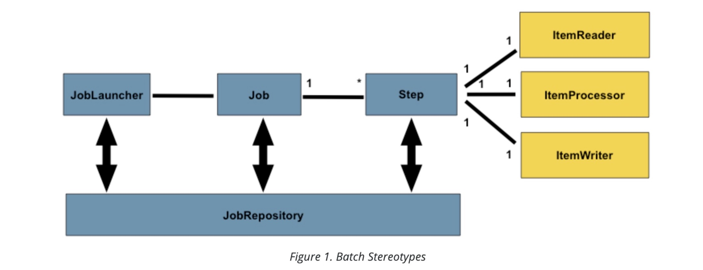
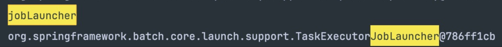
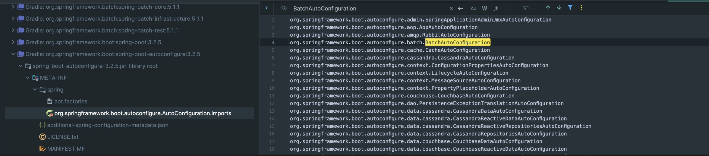

**:white_check_mark: ChatGPT 요약**   
이 글은 Spring Batch의 JobLauncher와 그 구현체들에 대해 설명합니다. JobLauncher는 Job과 JobParameters를 받아 Job을 실행하는 역할을 하며, 이를 통해 클라이언트가 구체적인 구현체에 의존하지 않고 Batch 작업을 실행할 수 있습니다. 또한, Spring Boot의 AutoConfiguration을 통해 TaskExecutorJobLauncher가 자동으로 Bean으로 등록되는 과정을 살펴봅니다. JobLauncher의 동작 원리와 SimpleJobLauncher의 구현 세부사항을 통해 Batch의 핵심적인 동작 방식을 이해할 수 있습니다.
<!-- truncate -->
<br></br>

## JobLauncher
---

```java
@FunctionalInterface  
public interface JobLauncher {  
    JobExecution run(Job job, JobParameters jobParameters) throws JobExecutionAlreadyRunningException, JobRestartException, JobInstanceAlreadyCompleteException, JobParametersInvalidException;  
}
```
JobLauncher는 Functional Interface로 Job과 JobParameters를 매개변수로 받아 Job을 실행하는 역할을 한다.
spring-batch-core에서 제공하는 JobLauncher 구현체는 SimpleJobLauncher와  TaskExecutorJobLauncher가 있는데 5.1.1 version 기준 SimpleJobLauncher는 Deprecated된 상태이다.
<br></br>


당연히 명시적인 설정 없이 Batch Application을 실행하면 TaskExecutorJobLauncher가 Bean으로 등록된다.
그런데 TaskExecutorJobLauncher는 어떻게 Bean으로 등록된 걸까.
<br></br>


### Spring Boot AutoConfiguration

Spring Boot에는 AutoConfiguration이라는 기능이 있다. 말 그대로 설정을 자동으로 구성해주는 것이다.
그 중 BatchAutoConfiguration이 존재하는데 Batch를 위한 설정들을 자동으로 구성해준다.
<br></br>

```java
package org.springframework.boot.autoconfigure.batch;

@AutoConfiguration(  
    after = {HibernateJpaAutoConfiguration.class, TransactionAutoConfiguration.class}  
)  
@ConditionalOnClass({JobLauncher.class, DataSource.class, DatabasePopulator.class})  
@ConditionalOnBean({DataSource.class, PlatformTransactionManager.class})  
@ConditionalOnMissingBean(  
    value = {DefaultBatchConfiguration.class},  
    annotation = {EnableBatchProcessing.class}  
)  
@EnableConfigurationProperties({BatchProperties.class})  
@Import({DatabaseInitializationDependencyConfigurer.class})  
public class BatchAutoConfiguration {


	@Configuration(  
	    proxyBeanMethods = false  
	)  
	static class SpringBootBatchConfiguration extends DefaultBatchConfiguration {
		...
	}
}
```
당연히 모든 Spring Application에서 적용되면 안 되기 때문에 BatchAutoConfiguration가 Bean으로 등록되기 위한 조건들이 Annotation으로 잔뜩 구성되어 있다.
BatchAutoConfiguration에는 여러 Bean과 Configuration class들이 있지만 JobLauncher는 SpringBootBatchConfiguration에 의해 등록된다.
<br></br>


```java
@Configuration(  
    proxyBeanMethods = false  
)  
@Import({ScopeConfiguration.class})  
public class DefaultBatchConfiguration implements ApplicationContextAware {

	@Bean  
	public JobLauncher jobLauncher() throws BatchConfigurationException {  
	    TaskExecutorJobLauncher taskExecutorJobLauncher = new TaskExecutorJobLauncher();  
	    taskExecutorJobLauncher.setJobRepository(this.jobRepository());  
	    taskExecutorJobLauncher.setTaskExecutor(this.getTaskExecutor());  
	  
	    try {  
	        taskExecutorJobLauncher.afterPropertiesSet();  
	        return taskExecutorJobLauncher;  
	    } catch (Exception var3) {  
	        throw new BatchConfigurationException("Unable to configure the default job launcher", var3);  
	    }}


	protected TaskExecutor getTaskExecutor() { return new SyncTaskExecutor(); }
}
```
SpringBootBatchConfiguration가 상속한 DefaultBatchConfiguration 내부를 보면 TaskExecutorJobLauncher로 구현된 JobLauncher를 Bean으로 등록한 걸 확인할 수 있다.
TaskExecutorJobLauncher를 생성하기 위해서는 JobRepository와 TaskExecutor가 필요한데 JobRepository는 다음에 다룰 기회가 있을 것 같아 넘어가자.
TaskExecutor로는 SyncTaskExecutor()를 기본적으로 사용하는데 별도의 Thread Pool을 사용하는 게 아니라 execute(Runnable task) 메서드를 호출한 Thread를 그대로 사용한다. 이름 그대로 동기적으로 동작하는 것이다.
<br></br>

```java
@Bean  
public ApplicationRunner runner() {  
	return args -> {    
		TaskExecutor executor = new SyncTaskExecutor();  
		
		executor.execute(() -> {  
			try {  
				Thread.sleep(10000);  
			} catch (InterruptedException e) {  
				throw new RuntimeException(e);  
			}            
			System.out.println(Thread.currentThread());  
			System.out.println(1);  
		});  
		
		executor.execute(() -> {  
			System.out.println(Thread.currentThread());  
		});
	};
}

// Thread[#1,main,5,main]
// 1
// Thread[#1,main,5,main]
```
ApplicationRunner를 활용해 간단히 SyncTaskExecutor의 동작을 확인해봐도 2개의 Runnable이 동일한 Thread(main)로 호출된 걸 확인할 수 있고 모두 2개의 Task가 순서대로 동작한 것을 볼 수 있다.
<br></br>

## 그래서 TaskExecutorJobLauncher는 어떻게 동작하는가?
---
```java
public class TaskExecutorJobLauncher extends SimpleJobLauncher {  
    public TaskExecutorJobLauncher() {  
    }  
    public JobExecution run(Job job, JobParameters jobParameters) throws JobExecutionAlreadyRunningException, JobRestartException, JobInstanceAlreadyCompleteException, JobParametersInvalidException {  
        return super.run(job, jobParameters);  
    }  
    
    public void setJobRepository(JobRepository jobRepository) {  
        super.setJobRepository(jobRepository);  
    } 
     
    public void setTaskExecutor(TaskExecutor taskExecutor) {  
        super.setTaskExecutor(taskExecutor);  
    }  

    public void afterPropertiesSet() throws Exception {  
        super.afterPropertiesSet();  
    }
}
```
구현체를 확인해보니 SimpleJobLauncher를 상속하고 있다...? SimpleJobLauncher는 Deprecated 상태인데.. 아마도 Migration이 가능하도록 하기 위함이라 생각한다.
SimpleJobLauncher 기반으로 JobLauncher를 이용하는 사람들도 지원을 해야하니...
<br></br>

## 결국은 SimpleJobLauncher
---
```java
public class SimpleJobLauncher implements JobLauncher, InitializingBean {
    public JobExecution run(final Job job, final JobParameters jobParameters) throws JobExecutionAlreadyRunningException, JobRestartException, JobInstanceAlreadyCompleteException, JobParametersInvalidException {
        Assert.notNull(job, "The Job must not be null.");
        Assert.notNull(jobParameters, "The JobParameters must not be null.");
        if (this.jobLaunchCount != null) {
            this.jobLaunchCount.increment();
        }

        JobExecution lastExecution = this.jobRepository.getLastJobExecution(job.getName(), jobParameters);
        if (lastExecution != null) {
            if (!job.isRestartable()) {
                throw new JobRestartException("JobInstance already exists and is not restartable");
            }

            Iterator var5 = lastExecution.getStepExecutions().iterator();

            while(var5.hasNext()) {
                StepExecution execution = (StepExecution)var5.next();
                BatchStatus status = execution.getStatus();
                if (status.isRunning()) {
                    throw new JobExecutionAlreadyRunningException("A job execution for this job is already running: " + lastExecution);
                }

                if (status == BatchStatus.UNKNOWN) {
                    throw new JobRestartException("Cannot restart step [" + execution.getStepName() + "] from UNKNOWN status. The last execution ended with a failure that could not be rolled back, so it may be dangerous to proceed. Manual intervention is probably necessary.");
                }
            }
        }

        job.getJobParametersValidator().validate(jobParameters);
        final JobExecution jobExecution = this.jobRepository.createJobExecution(job.getName(), jobParameters);

        try {
            this.taskExecutor.execute(new Runnable() {
                public void run() {
                    try {
                        if (SimpleJobLauncher.logger.isInfoEnabled()) {
                            SimpleJobLauncher.logger.info("Job: [" + job + "] launched with the following parameters: [" + jobParameters + "]");
                        }

                        job.execute(jobExecution);
                        if (SimpleJobLauncher.logger.isInfoEnabled()) {
                            Duration jobExecutionDuration = BatchMetrics.calculateDuration(jobExecution.getStartTime(), jobExecution.getEndTime());
                            Job var10001 = job;
                            SimpleJobLauncher.logger.info("Job: [" + var10001 + "] completed with the following parameters: [" + jobParameters + "] and the following status: [" + jobExecution.getStatus() + "]" + (jobExecutionDuration == null ? "" : " in " + BatchMetrics.formatDuration(jobExecutionDuration)));
                        }
                    } catch (Throwable var2) {
                        if (SimpleJobLauncher.logger.isInfoEnabled()) {
                            SimpleJobLauncher.logger.info("Job: [" + job + "] failed unexpectedly and fatally with the following parameters: [" + jobParameters + "]", var2);
                        }

                        this.rethrow(var2);
                    }

                }

                private void rethrow(Throwable t) {
                    if (t instanceof RuntimeException) {
                        throw (RuntimeException)t;
                    } else if (t instanceof Error) {
                        throw (Error)t;
                    } else {
                        throw new IllegalStateException(t);
                    }
                }
            });
        } catch (TaskRejectedException var8) {
            jobExecution.upgradeStatus(BatchStatus.FAILED);
            if (jobExecution.getExitStatus().equals(ExitStatus.UNKNOWN)) {
                jobExecution.setExitStatus(ExitStatus.FAILED.addExitDescription(var8));
            }

            this.jobRepository.update(jobExecution);
        }

        return jobExecution;
    }
}
```
로직은 그리 복잡하지 않다. MetaData Table에서 최근 JobExecution 데이터를 가져와 해당 Job이 재시작 가능한지를 체크한다.
이후 JobParameter를 검증한 후 JobExecution을 새로 생성하고 TaskExecutor로 Job을 실행한다.


## 정리
---
JobLauncher와 구현체에 대해 알아봤다. Batch가 어떻게 동작하는지 조금은 이해가 된다.
또 MetaData를 귀찮은 설정 정보쯤으로 예측했는데 MetaData와 JobRepository는 Batch의 핵심적은 부분인 것 같다.
나머지 요소들도 얼른 알아봐야겠다.
