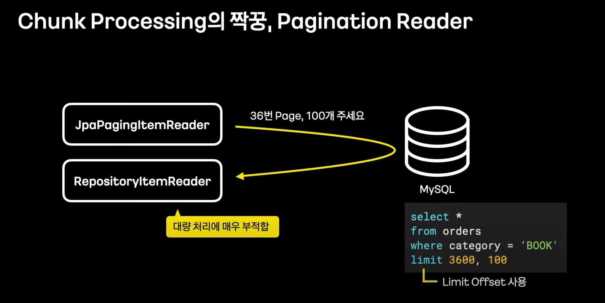
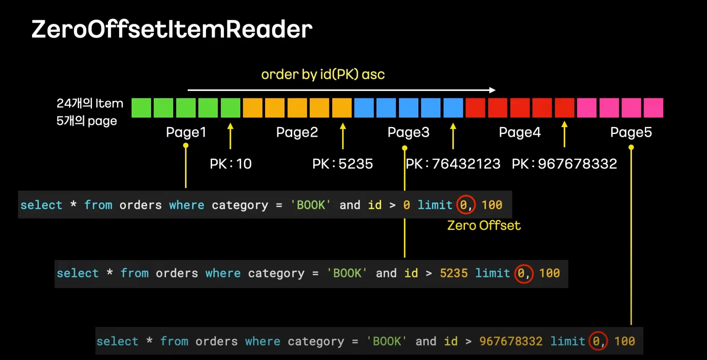
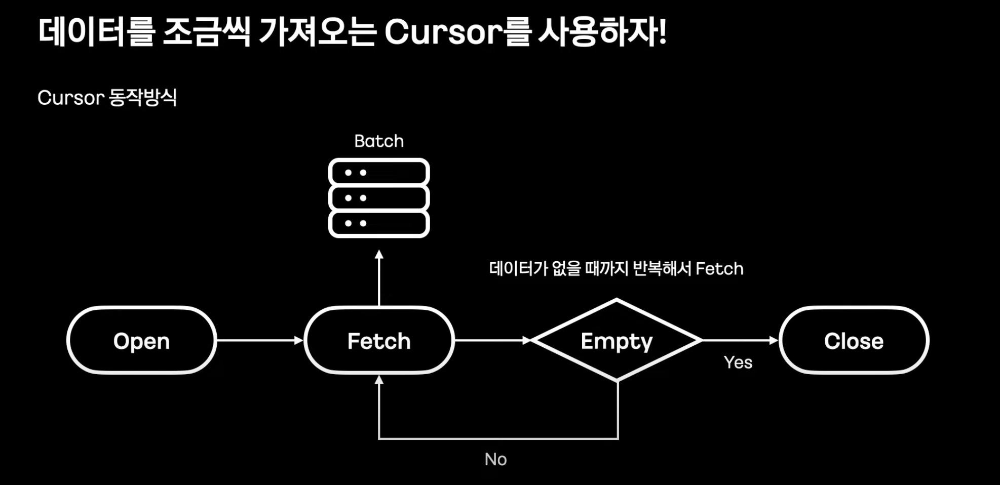
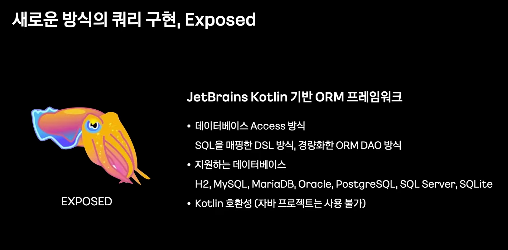
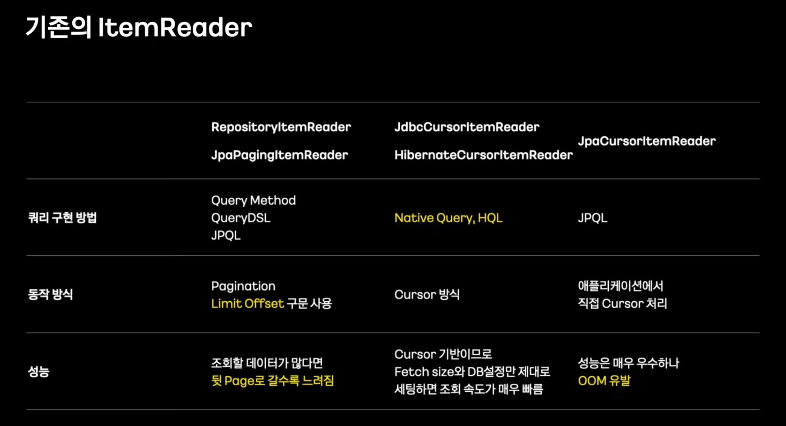
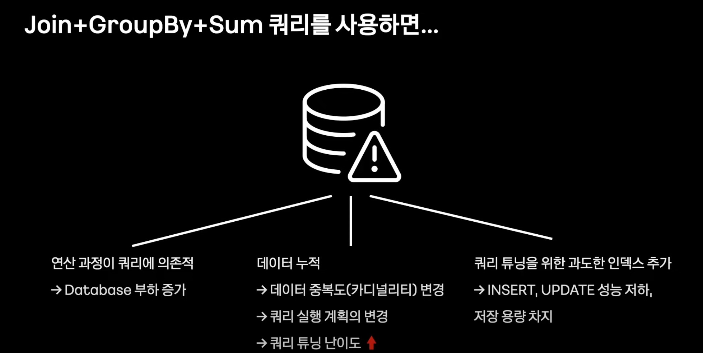
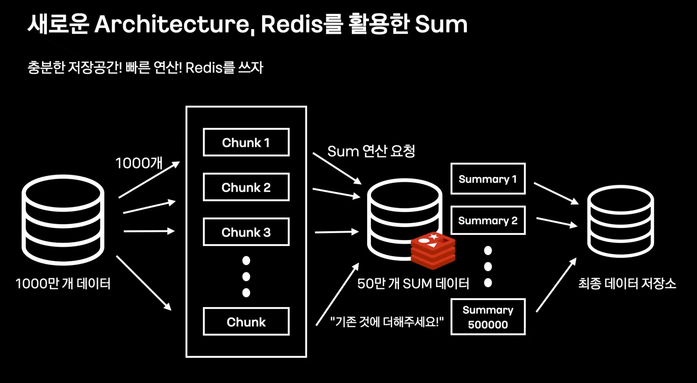
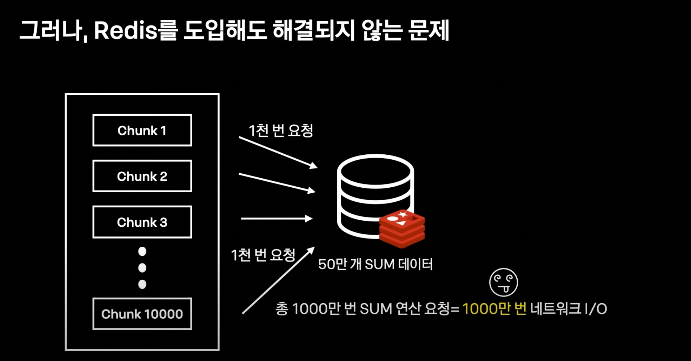

# Spring Batch Performance 극한으로 끌어올리기
## 1. When (Batch는 언제 사용하는가?)
- 특정 시간에 많은 데이터를 일괄 처리할 때
- 크게 3가지
    - 일괄 생성 (READ - CREATE - WRITE)
    - 일괄 수정 (READ - UPDATE - WRITE)
    - 통계 (SUM READ - CREATE - WRITE)

## 2. 대량 데이터 READ
- 대개 Reader가 큰 비중을 차지하고 있음 (복잡한 조회 로직 때문에)

### ChunkProcessing
- 나누어 처리하는 방식
- 대량 건을 처리할 때 필수적이다.

#### 문제점

- 기본적으로 limit Offset을 사용한다.
- 하지만 Offset이 커질수록 굉장히 느려진다.

#### 해결책 1

- Offset을 0으로 유지하는 방식으로 Query 사용

#### 해결책 2

- Cursor를 사용할 것
- Cursor 지원 ItemReader
    - JdbcCursorItemReader
    - HibernateCursorItemReader

#### 해결책 3(13:35)

#### 정리

## 3. 데이터 Aggregation 처리
- 통계를 만들 때 대부분 Batch로 개발을 생각한다. (GroupBy & Sum)
- 하지만, 데이터가 많아지고 쿼리가 복잡해져도 문제가 없을까?

#### 문제점

#### 해결책 1 -> GroupBy를 포기하자 (직접 Aggregation 하자)

- Aggregation을 직접하기 위해서는 App에 대용량 데이터를 직접 올려야 한다...
- 때문에 Redis를 활용!
- 근거
    - 연산 명령어 지원
    - 50만개는 넉넉히 저장 가능
    - 빠른 저장 + 영구 저장 X -> Aggregation용으로 적합

#### 또 다른 문제점

- 대용량 건을 모두 App에 올리지는 않지만
- 모든 건별로 네트워크 I/O가 발생한다

#### 또 다른 해결책
- Redis Pipeline 개발
- Chunk당 1번 Redis에 요청을 보냄

## 4. 효과적인 대량 데이터 WRITE
- Writer를 개선할 때 고려사항
    1. 일괄로 쿼리 요청
    2. 명시적인 쿼리 요청 (필요한 컬럼만 Update / 영속성 컨텍스트 사용 X)

- JPA를 사용하지 않은 이유
    - 읽기 / 쓰기 구간이 정해진 Batch에서는 Drity Checking과 영속성 관리는 필요하지 않은 기능임.
    - Update할 때 불필요한 컬럼도 Update
    - Batch Insert 지원이 어려움

## 5. Batch 구동 환경
### 문제점
- Batch는 어떤 시간 때에 몇 개의 Batch가 도는지 알기 어려워, 자원 관리가 어렵다.
    - 같은 물리 서버에서 여러 Batch가 동시에 돈다면 OOM을 발생시킬 수도 있다.
- Batch는 한 동작에 걸리는 시간이 길기 때문에 로그기 빈약하다.

### 해결 방법: Spring Cloud Data Flow
- K8s와 완벽한 연동으로 Batch 실행 오케스트레이션
- 유용한 정보 시각적으로 모니터링

## Reference
- [Batch Performance 극한으로 끌어올리기: 1억 건 데이터 처리를 위한 노력 / if(kakao)dev2022](https://www.youtube.com/watch?v=2IIwQDIi3ys)

