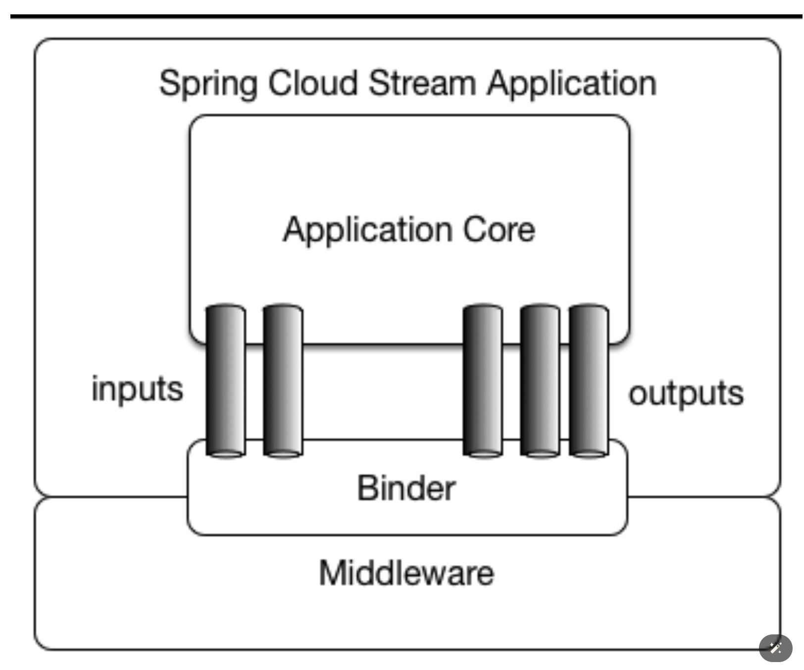
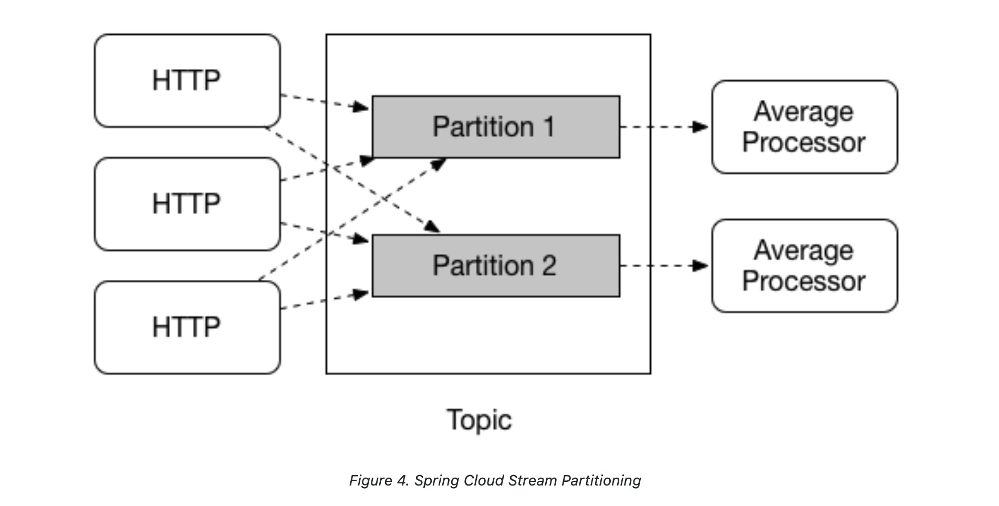

# Spring Cloud Stream - Main Concept
- Spring Cloud Stream은 message-driven microservice applicaiont을 구현하기 위환 여러 추상화와 구성 요로를 제공한다.
- 해당 챕터에서는 여러 추상화와 구성 요소를 설명할 예정이다.

## Application Model

- spring cloud stream application 기본적으로 middleware와 중립적인(연관이 없는) Core로 구성된다.
  - middleware는 kafka, rabbitMQ와 같은 메시지 브로커를 뜻한다.
- Application Core는 external broker의 도착지와 설정된 input/output 사이를 연결하여 외부와 소통한다.
- 연결에 필요한 external broker별 세부 사항은 Binder 구현에서 처리가 된다.
- spring cloud stream의 핵심은 여기에 있는 것 같다.
- message 처리 로직과 message 저장소의 결합을 끊어 Core에는 message에 대한 처리 로직만 남길 수 있는 것이다.

## The Binder Abstraction
- Spring Cloud Stream은 Kafka, Rabbit MQ에 대한 Binder 구현체를 제공한다.
- 통합 테스트를 위한 Test Binder 또한 제공한다.
- Custom Binder를 구현할 수도 있다.
- 환경 구성을 위핸 Spring Boot를 사용하며 Binder Abstraction을 통해 application은 middleware 선택에 있어 유연해진다.
- 또한 같은 message 처리 로직으로 Rabbit MQ, Kafka에 모두 적용할 수 있다.
- 심지어는 runtime 시점에 external destination과 message handler(매개 변수 혹은 반환 값)를 동적으로 변환할 수도 있다.

## Persistent Publish-Subscribe Support
- Pub-Sub 구조는 Spring Cloud Stream Application의 일반적인 사용 방식이다.
- Pub-Sub 구조의 장점
  - Producer와 Consumer의 복잡성을 낮춘다.
  - 기존 Flow에 영향 없이 신규 Application을 추가할 수 있다.

## Consumer Groups
- Pub-Sub 구조에서 하나의 Consumer Application이 여러 Instance로 구성될 수 있다.
- Spring Cloud Stream은 이를 위해 `spring.cloud.stream.bindings.<bindingName>.group=` 설정값을 활용하여 Consumer application을 식별한다.
- 같은 group에 이는 Instance들 중 하나의 Instance만이 message를 처리하도록 동작하게 된다. (한 message는 하나의 instance로만 전달됨 - 중복 처리 x)
- group 설정이 없다면 익명 구독(anonymous subscription)이 진행됨
- group을 꼭 설정해야 application이 shut down 되었다가 다시 올라와도 메시지 중복 처리를 막을 수 있다.

## Consumer Types
- Message-driven
- Polled
- version 2.0 이후로 asynchronous consumer와 함께 synchronous consumer도 제공된다.

## Partitioning Support

- 특정 Applicaiton의 여러 Instance간에 데이터 파티셔닝 기능을 지원한다.
- Partition의 관점에서 물리 message 저장소 (예를 들어 broker의 topic)는 여럿으로 분리되어 있다고 간주된다.
- 또한 1개 이상의 producer application instance는 1개 이상의 consumer application instance로 데이터를 전달하고
- 같은 특성으로 간주된 데이터는 같은 consumer instance에서 소비된다. (kafka로 생각하면 특성을 key값으로 보면 될듯)
- 하지만 Spring Cloud Stream에서 특별한 점은 broker의 종류와 관계 없이 공통된 방식으로 partition 기능을 이용할 수 있다는 점이다.
  - broker가 기본적으로 partitioning이 되어 있든(kafka) 되어 있지 않든(rabbit MQ)