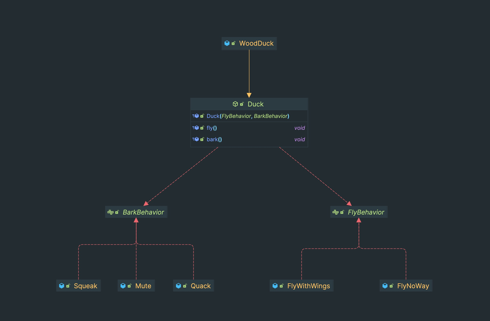

## Strategy Pattern은 무엇인가?
--- 
`Strategy Pattern`은 알고리즘군을 정의하고 캡슐화해서 각각의 알고리즘군을 수정해서 쓸 수 있게 만든다.
이 패턴의 가장 큰 장점 중 하나는 클라이언트로부터 알고리즘을 분리해서 독립적으로 변경할 수 있다는 점이다.
Strategy Pattern을 사용하면 얻을 수 있는 장점을 정라하자면 아래와 같다.
- 알고리즘의 변형 및 확장이 쉽다.
- 코드 재사용성이 높아진다.
- 객체 간의 결합도가 낮아져 유지보수가 용이하다.
  알고리즘이란 단어를 사용해 조금 설명이 조금 와닿지 않는데 코드를 기반으로 한번 알아보자.
  <br></br>

### (1) 코드로 알아보는 Strategy Pattern
```java
public abstract class Duck {
    .. 여러 공유 메서드

}
```
위와 같은 코드가 있다고 가정해보자. abstract class임을 고려했을 때 Duck 클래스를 상속한 여러 Duck들이 있을 거라 예측할 수 있다.
이런 상황에서 몇몇의 Duck에 fly(), bark() 메서드를 추가해야 한다는 요구사항이 온다면 코드를 어떻게 고칠 수 있을까? 이 구조를 유지한다면 2가지 방법을 떠올릴 수 있다.
1. Duck 클래스에 구현된 메서드를 두고 다른 방식으로 동작하는 구현체에서는 일일이 Override를 해준다.
2. 추상 메서드를 두고 각 구현체에서 일일이 구현을 해준다.
   구현이 불가능하지는 않지만 동일한 방식으로 fly(), bark()를 수행하는 Duck들도 모두 개별 메서드로 관리가 필요하다는 점에서 아쉬운 점이 남는다.
   <br></br>

### (2) Interface 적용해보기
```java
public interface Flyable {
    void fly();
}

public interface Barkable {
    void bark();
}
```
Duck Class는 그대로 두고 위와 같은 Interface를 추가하여 날 수 있거나 짖을 수 있는 구현체에서 두 Interface를 구현하는 방식은 어떨까?
이 방식을 필요한 구현체에만 fly(), bark() 메서드를 적용할 수 있다는 점에서 이전 방식보다는 괜찮아 보인다.
하지만 동일한 방식으로 동작하는 fly(), bark()도 각 구현체에서 개별적으로 구현하고 관리해야 한다는 점에서는 이전 방식과 동일한 문제점이 있다.
<br></br>

### (3) Strategy Pattern 적용해보기
헤드 퍼스트 디자인 패턴 책에서는 아래와 같은 디자인 원칙을 제안한다. 두 원칙을 기반으로 코드를 더 나은 구조로 개선해보자.
- `애플리케이션에서 달라지는 부분을 찾아내고, 달라지지 않는 부분과 분리한다.`
- `구현보다는 인터페이스에 맞춰서 프로그래밍한다.`
  <br></br>

```java
// interface
public interface BarkBehavior {
    void bark();
}

public interface FlyBehavior {
    void fly();
}
```
```java
// implemantations
public class FlyNoWay implements FlyBehavior {
    @Override
    public void fly() {
        System.out.println("Do Nothing");
    }
}

public class FlyWithWings implements FlyBehavior {
    @Override
    public void fly() {
        System.out.println("Fly with wingsç");
    }
}

public class Quack implements BarkBehavior {
    @Override
    public void bark() {
        System.out.println("Quack!");
    }
}

public class Mute implements BarkBehavior {
    @Override
    public void bark() {
        System.out.println("Do Nothing");
    }
}
```
우선 달라지는 부분과 달라지지 않는 부분을 생각해보자. 구현체마다 달라지는 부분은 fly(), bark()일 것이고 달라지지 않는 부분은 Duck abstrat class에 있는 로직들일 것이다.
그렇다면 fly()와 bark()를 Duck에서 분리해서 만들어보자. 위 코드와 같이 나는 행동과 짖는 행동을 책임지는 인터페이스를 만들고 이를 구현한 구현체들을 둔다.
그리고 Duck에서는 BarkBehavior와 FlyBehavior 인터페이스를 필드로 두고 필요에 따라 원하는 구현체를 쓴다면 이전까지 문제였던 동일한 동작의 bark(), fly()에 대해 Duck 구현체에서 일일이 구현할 필요가 사라진다.
<br></br>


```java
public abstract class Duck implements BarkBehavior, FlyBehavior {

    // final을 제거하고 setter 메서드를 추가해 Runtime 환경에서 전략을 변경할 수도 있다.
    private final FlyBehavior fiyBehavior;
    private final BarkBehavior barkBehavior;


    public Duck(FlyBehavior fiyBehavior, BarkBehavior barkBehavior) {
        this.fiyBehavior = fiyBehavior;
        this.barkBehavior = barkBehavior;
    }

    public void fly() {
        fiyBehavior.fly();
    }

    public void bark() {
        barkBehavior.bark();
    }
}
```
위 사진과 코드는 의존성 다이어그램과 Strategy Pattern을 적용한 Duck Class이다.
코드처럼 final 필드로 두고 생성자로 Strategy를 받을 수도 있지만, Setter 메서드를 활용해 Runtime 환경에서 때에 따라 전략을 바꿔가며 사용할 수도 있다.
이제 다시 Strategy Pattern의 장점을 보자. 이 예시에서 알고리즘은 fly()와 bark()이다. 이제는 왜 Strategy Pattern이 아래와 같은 장점을 가지는지 이해할 수 있을 것이다.
- 알고리즘의 변형 및 확장이 쉽다.
- 코드 재사용성이 높아진다.
- 객체 간의 결합도가 낮아져 유지보수가 용이하다.
  <br></br>


## Strategy Pattern 실제 사용 예시: DispatcherServlet과 HandlerMapping
---
```java
public class DispatcherServlet extends FrameworkServlet {
    ...
    @Nullable
    private List<HandlerMapping> handlerMappings;
    
    // handlerMappings를 순회하며 request에 맞는 HandlerMapping을 찾는 메서드
    @Nullable
    protected HandlerExecutionChain getHandler(HttpServletRequest request) throws Exception {
        if (this.handlerMappings != null) {
            Iterator var2 = this.handlerMappings.iterator();

            while(var2.hasNext()) {
                HandlerMapping mapping = (HandlerMapping)var2.next();
                HandlerExecutionChain handler = mapping.getHandler(request);
                if (handler != null) {
                    return handler;
                }
            }
        }

        return null;
    }
    
    
    ...
}


public interface HandlerMapping {
    ...

    default boolean usesPathPatterns() {
        return false;
    }

    @Nullable
    HandlerExecutionChain getHandler(HttpServletRequest request) throws Exception;
}
```
spring-boot-starter-web 의존성을 추가하면 DispatcherServlet class와 HandlerMapping interface가 포함되어 있다.
그리고 HandlerMapping interface를 구현한 여러 구현체들도 제공이 된다.
DispatcherServlet은 여러 HandlerMapping List 형태로 가지고 있고 요청이 들어왔을 때 구현체를 순차적으로 조회하여 요청에 맞는 Handler를 찾고 Handler 로직을 수행한다.
이전 예시와 대응해서 생각해보면 DispatcherServlet이 Duck, HandlerMapping이 FlyBehavior나 BarkBehavior, 그리고 각 Interface의 구현체들로 구성되어 Strategy Pattern이 적용된 것을 확인할 수 있다.